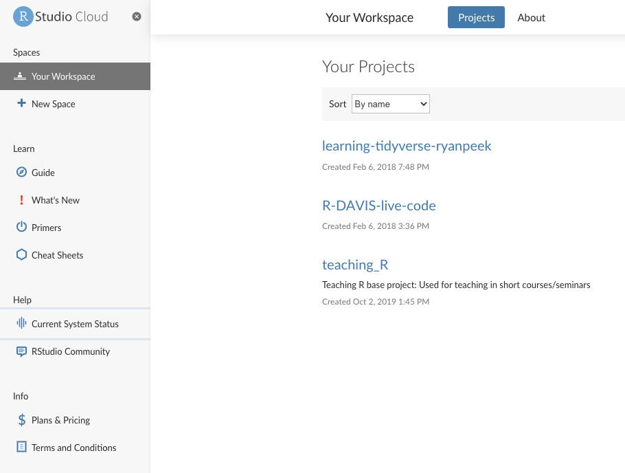

```{r setup, include=FALSE}
knitr::opts_chunk$set(echo = TRUE)
```

<style>
  .title{
    display: none;
  }
</style>

<br>
<br>

## Setting up RStudio Cloud

If or when it just isn't feasible to install R and RStudio on your computer or device, don't worry! There is an alternate option. We can use [RStudio Cloud](https://rstudio.cloud/), which is free, and provides about 15 hours per month of free and functional computing time in a virtual RStudio environment.

What does this mean? It basically means you can use and do whatever you would like in R in an online browser window.

### Pros {.unlisted .unnumbered}

 - Platform or operating system independent
 - install any and all packages that you need or want
 - can import and export data, code, results, to/from the cloud or your computer
 - its all online!! So it's all backed up there the next time you login
 
### Cons {.unlisted .unnumbered}

 - it's all online! So you need a stable internet connection
 - the free account provides 15 hours of computing time per month
 
<br><br>
 
## Signing Up

To set everything up, we need to sign up and create a new account.

 1. Go to **https://rstudio.cloud/**
 2. Sign up with an email and create a password of your choosing
 3. Sign In!
 
 <br>
 
```{r, echo=F, out.width='100%'}

knitr::include_graphics("images/rstudio_sign_up.png")

```
 <br><br>
```{r, echo=F, out.height='70%'}

knitr::include_graphics("images/rstudio_sign_in.png")

```

<br>

## Navigating inside the Cloud 

Once you log in, you should look for a few things. On the left hand side, you should see column that displays your "**Spaces**" (where your RProjects will live), a place you can check for **Learning**, as well as some additional info on the system status and terms and conditions.

<br>

```{r, echo=F, out.width='100%'}



```

<br>

On the right hand side, you should see a small chart showing your **Account Usage**. This is what you want to keep track of. Depending on how much time you spend actually running code, your time will vary, but the standard free account provides 15 hours per month. 

```{r, echo=F, out.width='50%'}

knitr::include_graphics("images/rstudio_cloud_right_hand_menu.png")

```


### **Getting Setup!**

1. Click on **`New Project`**, and wait a second for things to initialize.
2. Name your project **`CABW_R`**
3. Copy and install the packages we'll need. This can take a few minutes, so grab a cup of coffee or tea!

```
install.packages("tidyverse")
install.packages("sf")
install.packages("mapview")
install.packages("viridis")
install.packages("USAboundaries")
install.packages("openxlsx")
install.packages("readxl")
install.packages("lubridate")
```

4. Check everything is installed...you should get **`TRUE`**'s if everything worked.

```
c("tidyverse", "sf", "viridis", "mapview", "USAboundaries") %in% installed.packages()
```
