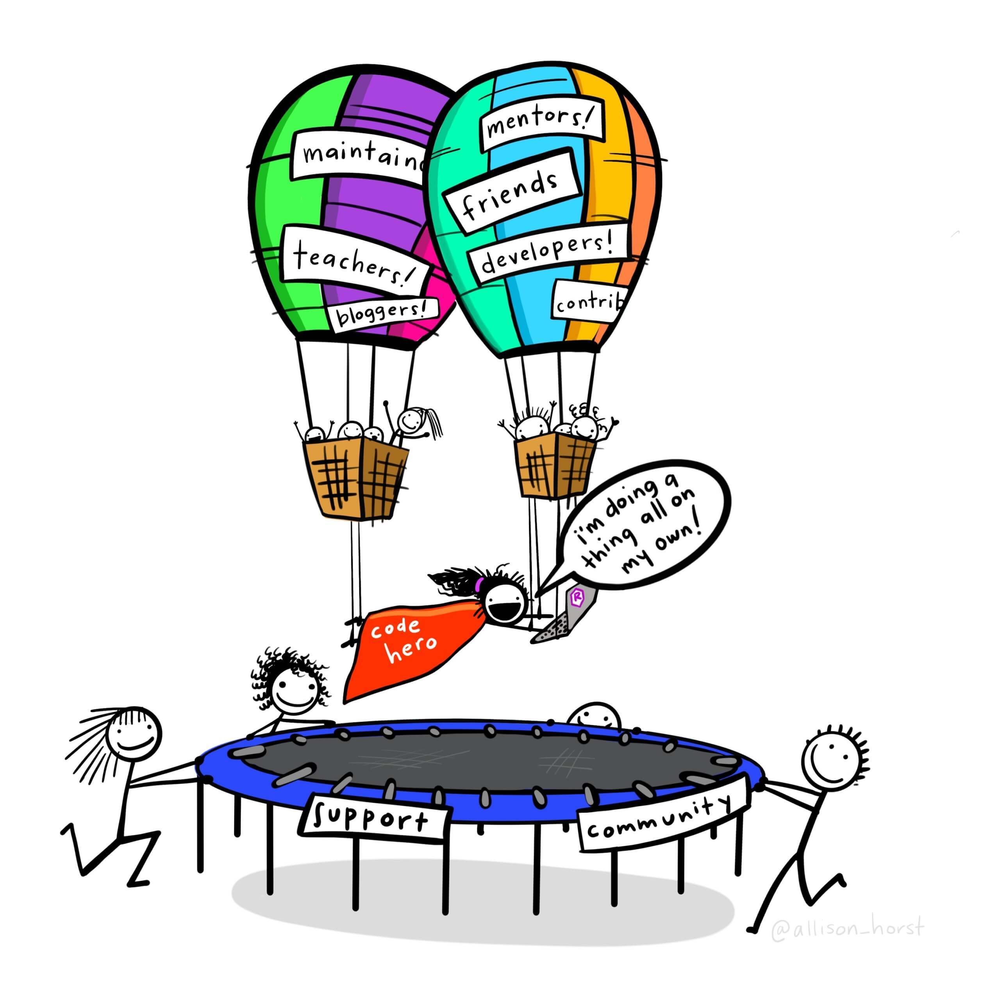

```{r setup, include=FALSE, purl=FALSE, message=FALSE}

library(knitr)

```

:::obj

**Learning objectives**

 - Interpreting error messages 
 - Understand classes
 - Using built-in help  
 - Reading R help documentation
 - Minimal, reproducible example
 - How to search for answers and ask questions


:::


## Error messages

<!-- <aside> -->
```{r bryan-aside, out.width='80%', echo=FALSE, fig.cap = "[Jenny Bryan's rstudio::conf(2020) talk](https://www.youtube.com/watch?v=vgYS-F8opgE) is a comical and educational deep dive into debugging."}
knitr::include_graphics("images/bryan_try_again.png") 
```
<!-- </aside> -->

Interpreting error messages is a normal part of working with R. Getting errors is expected, and no amount of practice will prevent errors from happening. What practice **will change** however, is your ability to diagnose and address errors. In this module, we cover a few seasoned approaches to "get unstuck" when you encounter errors in R.

```{r error-message, out.width='80%', echo=FALSE, fig.cap = "The fabled error message: '`object of type 'closure' is not subsettable`'. This hard-to-interpret error arises when we try to subset an object that can't be subset. In this example, the function `mean()` doesn't have an index `[1, ]` so we get this opaque error."}
knitr::include_graphics("images/closure-error.png") 
```


## Class

In R, every object has a **class**, which defines the operations we can perform on it. We can check the class of an object with the `class()` function. 

<aside> Recall the classes of atomic vectors (logical, numeric, factor, character) from the [module on data structures](04_data_structures.html#basic-object-classes). </aside>

```{r class, message=FALSE, warning=FALSE}
library(tidyverse)

# check the class of the function, "mean"
class(mean)

# check the class of other objects we've seen before
class(1:10)
class("a string")
class(tibble(x = 1:10, y = "a string"))
```

Knowing the class of object you're working with can help orient questions you may ask online, and will also help you interpret built-in documentation.  


## Using built-in help

One of the best features about R is the standardized package documentation. Once you learn how to read package documentation, you'll be able to read about functions in any package and learn what arguments they take, the class of arguments they expect (incorrect objects passed to functions is common error), and the object and object class they output. 

To illustrate, below is an example of an error that we can diagnose by consulting the help for `?mean`.

```{r mean-error, eval = FALSE}
numbers <- c("10", "50", 100)
mean(numbers)
```

```{r, echo = FALSE}
numbers <- c("10", "50", 100)
```


```{r mean-error-img, out.width='80%', echo=FALSE,}
knitr::include_graphics("images/error_mean.png")
```

The help for `mean` (enter `?mean` in the console) indicates that the Argument `x` only has methods for numeric/logical vectors, and date, date-time, and time interval objects.  

```{r mean-help, out.width='80%', echo=FALSE,}
knitr::include_graphics("images/help_mean.png")
```

What is the class of our object `numbers`?

```{r class-numbers}
class(numbers)
```


We tried passing a character string to `mean()` but there are no methods defined for strings, which led to an error. By checking the help and the class of the object, we were able to diagnose this problem. The fix is to change the class of the object to a numeric vector, which `mean()` supports according to the help documentation.

```{r class-change}
# change the class of the numbers object from character to numeric
numbers <- as.numeric(numbers)

# take the mean - this now works!
mean(numbers)
```


## Reading R help documentation

R help documentation is standardized, and thus predictable. Let's cover the anatomy of R help documentation, discussing each of the key sections and how to interpret them. Using help documentation for the function `?mean` once again:  

```{r help-anatomy, out.width='80%', echo=FALSE,}
knitr::include_graphics("images/help_anatomy.png")
```

<br> 

From top to bottom, these sections can be interpreted as follows. Once you understand this predictable structure of help documentation, you can interpret the documentation for new functions and expand your R vocabulary! This structure is the same across different R packages. 

<br>

|label | interpretation |
|------|----------------|
|`mean {base}` | Function name {package}  |
|`Arithmetic Mean` | Short function description |  
|`Description` | More detailed function description  |
|`Usage` | Function usage, showing the name and order of arguments  |
|`Arguments` | Description of the arguments taken by the function  |
|`Value` | Description of what the function returns |
|`References` | Citation or further documentation associated with the function |
|`See Also` | Related functions |
|`Examples` | Working examples to copy and paste that demonstrate the function in action |

<aside> Although the table to the left is based on the help for a **function**, some packages ship with **objects** like `data.frame`s that also have documentation. These objects don't have Arguments or a Value, since unlike functions, they don't take inputs and create outputs. For example, see the built-in dataset `?iris`. </aside>

:::challenge

<font color="#009E73">**Challenge 1**</font> 

1. Read the help for `ggplot`, `mutate`, and `filter` (make sure you click on `dplyr`'s filter).
2. Read the help for two other functions you've encountered in this course.  

:::

<br>

## Minimal reproducible example

More often than not, errors you encounter will not be the result of using the `mean()` function incorrectly, but due to unwieldy, large, and complicated data processing steps string together. Sometimes, the sheer amount of data you may want to process may be so large that it takes minutes until your code finally errors, and it becomes time-consuming to debug.

<aside> There's even an [R package](https://reprex.tidyverse.org/articles/reprex-dos-and-donts.html) designed to help R users create reprex. Many people have weighed in on the best way to create a reprex, including the developer of many of the R packages you've used in this course, who shares [their thoughts here](https://gist.github.com/hadley/270442). </aside>

A tried and true approach to solving errors is to create a **minimal, reproducible example**, or a **reprex** for short. 

According to Hadley Wickham,  

> There are four things you need to include to make your example reproducible: required packages, data, code, and a description of your R environment.

Thus, we can think of a reprex in terms of:  

1. **Packages**: loads all needed packages at the top of the script.  
2. **Data**: Uses a minimal dataset to capture the scope of the problem, so that the code solution can scale to the entire dataset later. Uses a dataset that everyone has access to. If not using a built-in dataset like `mtcars`, use `dput()` to "dump" your data into a form that can be copy/pasted and assigned to a variable.  
3. **Code**: Concisely describe the expected output and share a minimal code example highlighting the error using the minimal data.  
4. **Environment**: If you're sharing the reprex with others, run `SessionInfo()` in the console and copy and paste this into your reprex. Some errors can be diagnosed by looking at this information. 

You may create your reprex with the intention of sharing it with others, but find that in creating it, you actually solve your problem! That is not uncommon. The exercise of boiling a problem down to its most essential parts often sparks new ways of approaching a problem, or seeing it for what it really is.  


## Searching for answers and asking questions

```{r code-hero, out.width='80%', echo=FALSE,}

```


### Google

google with [R] + [package name] + [object type] + error

[screenshot]  

### community.rstudio

### StackOverflow

Associated stack sites (stats, geo). Don't be discouraged. 


```{r, out.width='80%', echo=FALSE}

# knitr::include_graphics("images/")

```


:::challenge

<font color="#009E73">**Challenge 1**</font> 

1. A common dplyr error and another join error since they just finished those 

:::

<br>

<details>
  <summary class="challenge-ans-title"><font color="#0072B2">**Click for Answers!**</font></summary>
  <div class="challenge-ans-body">

```{r challenge-1}

```

  </div>
</details>


<aside> 
```{r, out.width='80%', echo=FALSE, fig.cap="Use $ to access columns"}
# knitr::include_graphics("")
```
</aside>


:::challenge

<font color="#009E73">**Challenge 2**</font> 

1. 

:::

<br>

<details>
  <summary class="challenge-ans-title"><font color="#0072B2">**Click for Answers!**</font></summary>
  <div class="challenge-ans-body">

```{r challenge-2}

```

  </div>
</details>


