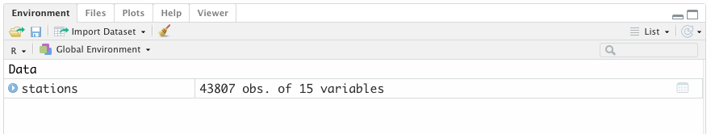
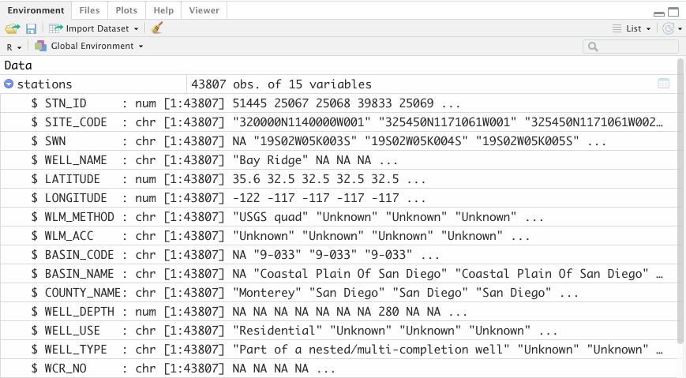

```{r setup, include=FALSE, purl=FALSE, message=FALSE}

library(knitr)

```

:::obj

**Learning objectives**
 
 - Assigning objects
 - Know basic object classes (logical, numeric, factor, character)  
 - Understand basic R data structures (vectors, lists, data.frames)
 - Know properties of R data structures and how to interact with them
 - Know how to spot and deal with missing values (`NA`)

:::

## Assignment

R is an object oriented programming language, which means that it is oriented around objects which can be data (e.g., data.frames, vectors, lists) or code (e.g., functions). We've already been using assignment to create variables, or objects. In the previous lesson, we read in csv files and **assigned** them to a variable using the assignment operator, `<-` (RStudio shortcut: `Alt` + `-`). Avoid using `=` for assignment which will also work but cause confusion later ([here's a blog post on the history behind `<-`](https://colinfay.me/r-assignment/)). 

When assigning an object, avoid overly simplistic names (e.g., `x`, `y`), and rather, pick concise names that describes the object and improve code interpretability. Let's read in our groundwater level station data and *assign* it to the variable name `stations`.

<aside>In R the only true rule about naming variables is we can't start a variable with a number or use special characters (i.e., +-!@#$%^*) </aside>


```{r assignment-data}
library(here)

# read the stations.csv file and assign it to an object "stations"
stations <- read.csv(here("data", "gwl", "stations.csv"))
```

Notice that in the Global Environment pane, we have now have a "Data" object `stations`.

```{r, out.width='80%', echo=FALSE}



```

Let's look at what types of data (*classes*) these columns currently have. We can use some useful functions that help us explore data a bit more, as well as use RStudio to figure these things out. We'll talk more about functions later -- there's an entire [module on functions]() coming up.

Let's look at `str()` or **structure** first. The same information can be displayed in RStudio by clicking the blue arrow in the Environment tab.

```{r structure}
str(stations)

```

```{r, out.width='80%', echo=FALSE}



```


This function `str()` tells us the structure of the data. It gives us:

 - the type of Data (`data.frame`)
 - the column names (the part after `$`) 
 - the **data class** (`int`=integer, `num`=numeric, `chr`=character)
 - the number of rows in our dataset (or the length of the vector)
 - finally, the the first 5 values for that vector 

## Basic object classes

Every object in R has a `class` property, and each property defines what functions will work on it. Many bugs result from functions applied to the wrong object class, so it's important to know how to check the class of an object and figure out what functions can be applied to it. 

There are more base object classes in R, like matrices and arrays, but in this course we will focus on vectors, and devote most of our attention to a special type of list called the `data.frame` or `tibble`.  

Let's check the class of the objects we created above with the `class()` function:

```{r class-data}
class(stations)
```

What about for a single column? Or a value we assign to some text?

```{r class-col}
class(stations$SITE_CODE)

river_name <- "Sacramento River"
class(river_name)

```


As expected, `stations` is a data.frame, `stations$SITE_CODE` is a vector of *character*, and `river_name` is a single value of class *character*. **Vectors** are objects where every entry in that object is the **same type of data**. Sometimes, these are called **atomic vectors** because each part of the vector is the same.

There are 4 major classes of atomic vectors, arranged below in order of complexity.  

* **logical** (`TRUE`, `FALSE`)  
* **numeric** (contains both integer and double, but we will only cover double)  
* **factor** (categorical and ordinal variables)  
* **character** (strings)  

Use the `c()` (**concatenate or combine**) function to create vectors. Let's use `c()` to create each of these 4 vector classes for an imaginary data set of river reaches.  

```{r c}

# logical: is the river dry at the time of measurement
dry <- c(TRUE, FALSE, FALSE)

# flow measured at each reach in cfs
flow <- c(0, 57, 128)

# month the measurement was taken
date <- factor(c("July", "January", "February"), levels = month.name)

# reach name
reach <- c("Dry Creek", "Raging Waters", "Wild Rapids")

```


Each vector above has **3 entries**, also called **elements**. We can check the class of each of these vectors:

```{r vectors-check-classes}

class(dry)
class(flow)
class(date)
class(reach)

```

### logical (boolean)

Logical vectors (also called booleans) are the most simple type of atomic vectors, and can take one of three values: `TRUE`, `FALSE`, or `NA`. Logical vectors are output as the result of logical tests.

<aside> There are many ways to query or use logical tests for data. In other languages like SQL, these are words like **AND**, **OR** **IN**. In R, we use **`&`** for AND, **`|`** for OR, and **`%in%`** for IN. For more on this see [Fig 5.1 in R4DS](https://r4ds.had.co.nz/transform.html#logical-operators). </aside>

```{r logical-test}

# Is the character string "Merced River" in the character vector "reach"?
"Merced River" %in% reach

# Is the character string "Raging Waters" in the character vector "reach"?
"Raging Waters" %in% reach

```


### numeric

Imagine you wanted to transform the numeric flow data you have from cubic feet per second (cfs) to gallons per minute (gpm). R is a "vectorized" language and allows transformations over an entire vector with relative ease.

```{r numeric-vectorized}

# convert each element of "flow" from cfs to gpm by multiplying by 448.83
flow_gpm <- flow * 448.83

# print the result
flow_gpm

```


### factor

If our factor variable `month` was an ordinary character vector, it would not sort meaningfully.

```{r factor-sort}

date_character <- c("July", "January", "February")
sort( date_character )

```

The above is out of order, but if we define the **levels** that these ordinal variables should follow, we can store the vector as a factor and get meaningful sorting behavior. R defaults to alphabetic order with character vectors.

```{r factor-sort-2}

# create a factor by specifying the levels (order) of the variable
date <- factor(c("July", "January", "February"), levels = month.name)
sort(date)

```

### character (string)

Character vectors can store arbitrary strings. There are many ways to work with strings from [basic string manipulation](https://r4ds.had.co.nz/strings.html), all the way to [natural language processing](https://www.tidytextmining.com/) that we don't have time to cover in this course, but you should know that they exist. 

Create strings by enclosing them with quotation marks. It doesn't matter if you use single (') or double quotes ("), just be sure to use the same quote style for a single character string!  

```{r char-quote}

# create a character vector of length 1 using single quotes
hello <- 'Why helloooo'

# create a character vector of length 2 using double quotes
instructors <- c("Rich", "Ryan")

# paste the vectors together
paste(hello, instructors)

```

Notice that when we pasted together a vector of length 1 with a vector of length 2, we got an output character vector of length 2. This concept is called "recycling" (because the shorter length vector was used twice, or recycled) and will come back later in this module.  


:::challenge

<font color="#009E73">**Challenge 1**</font> 

1. Create an character vector called `meals` and assign it a string with what you plan to have for for breakfast, lunch, and dinner today.  
2. Create a numeric vector called `cost` with the approximate cost in dollars of each meal.  
3. Calculate the cost each meal if you ate that and only that for 365 days a year (Hint: multiply `cost` by 365, then take the `sum()`).  
4. **Bonus**: Paste together a string that announces this cost.  

:::

<br>

<details>
  <summary class="challenge-ans-title"><font color="#0072B2">**Click for Answers!**</font></summary>
  <div class="challenge-ans-body">

```{r challenge-1}
# create a string of three meals
meals <- c("eggs, toast and coffee", "pizza", "tacos and salad")

# cost of each meal in dollars
cost <- c(2.25, 5.50, 8.95)

# annual cost
annual_cost <- cost * 365
sum(annual_cost)

# bonus
paste("Three meals a day costs", sum(annual_cost), "per year.")
```

  </div>
</details>


## Basic data structures

Vectors are the building blocks of more useful data structures, especially the `data.frame` and `tibble` that will be the focus of subsequent modules. 

### vector

Above, we covered atomic vectors, which have one and only one class (logical, factor, numeric, character). All vectors have a property of `length` greater than 1.

```{r vector-length}

length(reach)
length(flow)

```


### list

A special type of non-atomic vector called the `list` can contain many different types of data. Lists can contain any types of data structures, even other lists!

```{r list}

l <- list(dry, reach, flow, "a random string")
length(l)

```


We can access list elements with double bracket notation `[[` and the index (think row number) of the element we want. 

```{r list-access}

# access first element of the list
l[[1]]

# access second element
l[[2]]

# access third element
l[[3]]

```

We can also name a list, and then access list elements with double-bracket notation and **name** instead of index, like so: 

```{r}
names(l) <- c("dry", "reach", "flow", "string")
l[["dry"]]
```


### data.frame and tibble

The `data.frame` is perhaps the most common form of data you will encounter in R, and the focus of most of the rest of the modules in the course. The data frame is a set of named vectors arranged as columns all of a common length, typically atomic vectors, but they can host general vectors or lists as well^[List-columns are a special type of data that we will cover elsewhere.]. 

Let's use the vectors we created earlier to make a `data.frame` called `riv`.  

```{r dataframe}

riv <- data.frame(reach, date, dry, flow)

riv
```

We can access any column from the data frame as a vector using the `$` notation. In RStudio, typing `$` also brings up an auto-complete, and we can see all of the columns in the `data.frame`.

<aside> 
```{r, out.width='80%', echo=FALSE, fig.cap="Use $ to access columns"}
knitr::include_graphics("images/R_dollar_sign_example.png")
```
</aside>

```{r df-dollar-sign}
riv$reach
riv$flow

```

We can also use `$` to remove a column if we assign an existing column to a value of `NULL`, or add a **new column** by entering a new column name not already present, and assigning it a value.  

```{r df-rm-col}

# remove the "Reach" column
riv$reach <- NULL
riv

```


```{r df-add-col}

# Add the reach column back, but called "reach_name" this time
riv$reach_name <- reach
riv

```

When we assign a vector to a `data.frame` with length less than the total number of rows of the `data.frame`, R will try to "recycle" the vector.

```{r df-recycling, eval = FALSE}

# add a vector "tech" for the "field technician" to be recycled
riv$tech <- c("Rich", "Ryan")

```

Uh oh! This won't work because the length of the vector we attempted to add (2) to the `data.frame` isn't equal to, or a multiple of, the number of rows (3).

```{r df-recycling-2}

nrow(riv) # total rows is 3
nrow(riv) == length(c("Rich", "Ryan"))

```

However, if we add a vector to the `data.frame` with length 1 (which is a multiple of 3):  

```{r, df-recycling-3}

riv$tech <- "Rich"
riv

```

R **recycles** the string "Rich", repeating it 3 times. This is convenient, but can also lead to silent bugs, so we advise using the `tibble` instead of the `data.frame`.

The `tibble` is a modern `data.frame` with stricter recycling rules, R-friendly print behavior (prints only the first 10 rows and shows column types), and a [few more features](https://cran.r-project.org/web/packages/tibble/vignettes/tibble.html) that make them more predictable and less likely to lead to bugs.

To use `tibble` data types, we need to read our data with one of the [`{tidyverse}`](https://www.tidyverse.org/) packages,[`{readr}`](https://readr.tidyverse.org/). 
When we read `stations` with `read_csv()` it reads it in as a tibble, which we can verify with `class(stations)`. We can always convert `stations` back to just a data.frame and print it to console by running `data.frame(stations)`. 

```{r, df-stations}
library(readr)
stations <- read_csv("data/gwl/stations.csv")
stations_df <- data.frame(stations)
class(stations_df)
```

`tibble`s are essentially spreadsheets in R, flat, 2D rectangular data made of rows and columns. We can check the number of rows and columns in a `tibble`. 

```{r df-dim}

dim(stations)
nrow(stations)
ncol(stations)

```

A `tibble` combines lists into columns, so its length is the same as its number of columns.  

```{r, df-length}

length(stations) 

```


:::challenge

<font color="#009E73">**Challenge 2**</font> 

1. Extract the "LATITUDE" column from `stations`, assign it to a variable called `lat`, and calculate the mean latitude.  
2. Assign a column to `riv` called "depth" with values 1, 2, 3. 
3. Assign another column called "width" with values 10, 10, 10. Take advantage of recycling when creating the "width" column.  
4. Assign a new variable called "area" to `riv` which is the product of "depth" and "width" (Hint: `riv$depth * riv$width`).  

:::

<br>

<details>
  <summary class="challenge-ans-title"><font color="#0072B2">**Click for Answers!**</font></summary>
  <div class="challenge-ans-body">

```{r challenge-2}
# extract LATITUDE and calculate the mean value
lat <- stations$LATITUDE
mean(lat)

# add depth and width to riv
riv$depth <- c(1, 2, 3)
riv$width <- 10 # this vector of length 1 is recycled 

# calculate area and add it to riv
riv$area <- riv$depth * riv$width
```

  </div>
</details>


## A note on `NA`

`NA` has a special meaning in R and designates a missing value. Operations on a vector with missing values cannot return a value unless we explicitly tell R to ignore these missing values.

```{r, na}
z <- c(2, NA, 4)
mean(z)
sum(z)
```

```{r, na2}
mean(z, na.rm = TRUE)
sum(z, na.rm = TRUE)
```


*Lesson adapted from [R for Data Science](https://r4ds.had.co.nz/)*.


<br>  

<link rel="stylesheet" href="https://maxcdn.bootstrapcdn.com/bootstrap/4.0.0/css/bootstrap.min.css" integrity="sha384-Gn5384xqQ1aoWXA+058RXPxPg6fy4IWvTNh0E263XmFcJlSAwiGgFAW/dAiS6JXm" crossorigin="anonymous">

<a href="m_ggplot.html" class="btn btn-secondary" style="float: left">Previous module:<br> Data Visualization</a>
<a href="m_dplyr.html" class="btn btn-secondary" style="float: right;">Next module:<br> Data Wrangling</a>  
