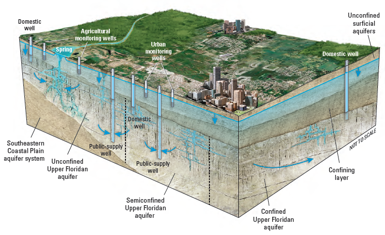

```{r setup, include=FALSE, purl=FALSE, message=FALSE}

library(knitr)
suppressPackageStartupMessages(library(tidyverse))

# may need to specify this option to get this to properly knit/print:
mapview::mapviewOptions(fgb = FALSE)

```

::: {.obj}
**Learning objectives**

-   Understand when and how to carry out Exploratory Data Analysis (EDA)
-   Practice EDA with tools and data from previous modules
:::

## What's EDA?

[Exploratory Data Analysis, or EDA](https://en.wikipedia.org/wiki/Exploratory_data_analysis), is an approach to data analysis that allows the data analyst to explore data and identify hypotheses or additional questions to test. In the book, [*R for Data Science*](https://r4ds.had.co.nz/exploratory-data-analysis.html), EDA is described as an iterative cycle where you:

> 1.  Generate questions about your data.
> 2.  Search for answers by visualizing, transforming, and modeling your data.
> 3.  Use what you learn to refine your questions and/or generate new questions for communication.

This process can be applied to any data, and is foundational to data science. Ultimately it is how we understand and then communicate our data.

(ref:ah-openscapes) *Illustration by @allison_horst for Dr. Julia Lowndes useR!2019 keynote.*

```{r, eval=TRUE, echo=FALSE, out.width='80%', fig.cap='(ref:ah-openscapes)'}
knitr::include_graphics("images/environmental-data-science-r4ds-general.jpg")
```

In previous modules, we've covered the building blocks to perform EDA in R, and in this module, we're going to bring it all together and perform EDA on the groundwater measurements dataset[^1] and CalEnviroscreen 3.0 data.[^2]

[^1]: DWR [Periodic Groundwater level database](https://data.cnra.ca.gov/dataset/periodic-groundwater-level-measurements).

[^2]: OEHHA [CalEnviroscreen 3.0 data](https://oehha.ca.gov/calenviroscreen/report/calenviroscreen-30).

We will focus on generating questions, and answering them through visualization.[^3]

[^3]: Statistical modeling is beyond the scope of this module, but if you are interested, you can read more about statistical modeling in R [here](https://r4ds.had.co.nz/model-basics.html).

## Generate questions

Our dataset contains observations of groundwater level measurements at monitoring stations throughout Sacramento County, and these observations have been spatially joined by census tract to CalEnviroScreen 3.0 (CES) scores.

To provide context for our analysis, the groundwater elevation dataset is based on measurements of the depth to groundwater in an aquifer system. These measurements are taken at individual wells (Figure 2).

(ref:aquifer) *Wells at different locations and depths in an aquifer, from [Wikimedia Commons](https://commons.wikimedia.org/wiki/File:Floridan_block_diagram.png).*

```{r gw-model, echo = FALSE, out.width="100%", fig.cap='(ref:aquifer)'}

```

To begin, let's ask a few general questions:

1.  What well uses (e.g., domestic, public, agricultural) are most common, and where are they located?\
2.  How do well depths compare between well uses?\
3.  What are the historical trends in groundwater elevation?\
4.  How do CES scores relate to groundwater level trends?

We will use the following packages in our EDA, so we load them now.

```{r pkgs}

library(here)
library(tidyverse)
library(sf)
library(mapview)

```

## Search for Answers

First we need to load our data, which we created in the module on [joins and binds](m_joins.html), and then inspect what's there.

```{r import-jb-data}

# groundwater level measurements joined to stations, perforations, and CES data

# load imports an object named "gwl"
load("data/sacramento_gw_data_w_calenviro.rda")

# alternatively we can specify an object name when using an .rds file
# gwl <- read_rds("data/sacramento_gw_data_w_calenviro.rds")

# check class, dim, names to refresh memory
class(gwl)
dim(gwl)
names(gwl)
```

We might want to use `View(gwl)` these data to refresh our memory. Remember when `View()`ing data in RStudio, that only 50 columns are shown at a time, so you need to click the arrows in the top navigation bar to move between sets of 50 columns.

<aside>

```{r manyrows, echo = FALSE}
knitr::include_graphics("images/manyrows.png")
```

</aside>

It appears that we have two columns with "County" information, so let's drop the column from CES and keep the one from the groundwater level dataset.

```{r gwl-clean}
gwl <- select(gwl, -`California County`)
```

Finally, let's keep in mind that the dataframe structure of this dataset is many samples per well through time (see the `SITE_CODE` is repeated for multiple `MSMT_DATE` observations through time).

### Question 1: Well use and location

What well uses are most common? We can answer this with `table(gwl$WELL_USE)`, but let's do the same thing with {`dplyr`} functions.

```{r well-use-count}
gwl %>% 
  count(WELL_USE) %>% # group by well use and summarize the count
  arrange(desc(n))    # sort in decreasing order 
```

We could have come to this same table by way of a plot.

```{r well-use-plot}

gwl %>% 
  ggplot(aes(WELL_USE)) +
  geom_bar() +
  coord_flip()

```

Let's clean things up a bit and make this plot more visually appealing.

```{r well-use-plot2}

p1 <- gwl %>% 
  count(WELL_USE) %>%   # group by well use and summarise the count
  arrange(desc(n)) %>%  # sort in decreasing order 
  filter(!is.na(WELL_USE)) %>% # remove NA well uses
  ggplot(aes(fct_reorder(WELL_USE, n), n)) + # reorder well use by n
  geom_col(aes(fill = WELL_USE)) +    # use column geometry
  coord_flip() +  # flip x and y axes
  theme_classic() + # use a theme
  labs(title = "Monitoring well use", 
       subtitle = "Sacramento County",
       x = "", y = "Count") +
  guides(fill = "none") # remove colorbar

p1
```

Understanding where wells are located is a spatial question, luckily these data contain spatial information we can use to make a map (see our last module [how to convert a dataframe to an sf object](m_intro_mapmaking.html#converting-a-dataframe-to-sf)). We know the well coordinates are using a projection and coordinate reference system in NAD83 (EPSG 4269), so we can convert this **`gw`** object to an {sf} object class. We will also import a Sacramento county polygon shapefile for plotting.

```{r gwl-to-sf}

# convert gwl from dataframe to sf
gwl <- st_as_sf(gwl, 
                coords = c("LONGITUDE", "LATITUDE"), # note x goes first
                crs    = 4269,                       # projection, NAD83
                remove = FALSE) %>%                  # don't remove lat/lon
  st_transform(3310) # convert to geographic CRS

# verify transformation worked
class(gwl)

# also read in the Sacramento county shapefile for plotting
# and transform it to the same crs as gwl
sac <- st_read("data/shp/sac/sac_county.shp") %>% 
  st_transform(st_crs(gwl))

# verify gwl points and sac polygon are in the same crs
st_crs(gwl)$epsg == st_crs(sac)$epsg

```

Let's plot the well use in Sacramento County, similar to what we did in the previous [mapmaking module](m_intro_mapmaking.html). Note, because we have many measurements per well we need to reduce these data to a `distinct()` list of `SITE_CODE`s. There are several ways to do this, but one option is to leverage how `group_by()` works, and `slice()` just **1** observation from each group, giving us a unique list of sites.

```{r gwl-map}

# because we're only plotting location, which doesn't change between 
# measurements, we slice the first observation per SITE_CODE
gwl_minimal <- gwl %>% 
  filter(!is.na(WELL_USE)) %>% # remove wells without a well use
  group_by(SITE_CODE) %>%      # take first well per site code
  slice(1) 

# check number of stations, should be n=486
length(unique(gwl_minimal$SITE_CODE))

# map
p2 <- ggplot() +
  geom_sf(data = sac) + 
  geom_sf(data = gwl_minimal, aes(color = WELL_USE), alpha = 0.4) +
  facet_wrap(~WELL_USE) +
  guides(color = "none") +
  theme_void()

p2
  
```

#### Combining Plots

The {patchwork} R package is great for combining plots. We can combine the previous 2 plots with a simple "`+`" once patchwork is loaded.

```{r patchwork, out.width="100%", preview = TRUE}
library(patchwork)

p1 + p2
```

These plots tell us a lot about the distribution of monitoring wells in Sacramento County. For instance, they show that irrigation and residential wells are among the most common known well uses. Interestingly, a substantial number of wells have an unknown use. Irrigation and residential wells appear collocated.

<br>

:::challenge

<font color="#009E73">**Challenge 1: Grouped summary**</font>

-   What is the average number of samples at each `SITE_CODE` per `WELL_USE`?
-   Can you express the distribution of samples at each `SITE_CODE` per `WELL_USE` as a boxplot?

:::

<br>

<details>
  <summary class="challenge-ans-title"><font color="#0072B2">**Click for Answers!**</font></summary>
  <div class="challenge-ans-body">

```{r chal-1a, eval=TRUE, echo=TRUE}

# group by the site code and well use and count
count(gwl, SITE_CODE, WELL_USE) %>% 
  pull(n) %>% 
  mean()
```

```{r chal-1b}

# express as boxplot of number of samples per site code, at each well use
count(gwl, SITE_CODE, WELL_USE) %>% 
  ggplot(aes(WELL_USE, n)) + 
  geom_boxplot() +
  # limit y axis scale to focus on main bulk of distribution
  coord_cartesian(ylim = c(0, 250)) 

```

  </div>
</details>

### Question 2: Well depths

Now that we understand a bit about the relative proportion and spatial distribution of wells, let's compare total completed depths, which measure how deep the well is and all else being equal, relates to the well's ability to access groundwater.

We made a plot that explored these trends in the previous mapmaking module.

```{r gwl-depth, echo = FALSE}
knitr::include_graphics("results/sac_well_depth_type.png")
```

We have the spatial distribution of these values, but now let's summarize the distribution of well depth values themselves.

```{r gwl-depth-boxplot}

gwl_minimal %>% 
  ggplot(aes(WELL_USE, WELL_DEPTH)) +
  geom_boxplot() + 
  coord_flip(ylim = c(0,1000)) # zoom in on main data distribution

```

It is clear that irrigation wells tend to be much deeper than residential, observation, and stock watering wells. There's about a 140 foot difference between median irrigation and residential well depth. We can calculate this exact difference as follows:

```{r wd-diff}

# median well depths
median_well_depths <- filter(gwl_minimal, 
                             WELL_USE %in% c("Residential", "Irrigation")) %>% 
  group_by(WELL_USE) %>% 
  summarize(med_depth = median(WELL_DEPTH, na.rm = TRUE)) %>% 
  st_drop_geometry() # don't need spatial data here, drop geometry column

median_well_depths

# difference of median well depths
diff(median_well_depths$med_depth)
```

<aside>

The `diff()` function returns the difference between each value pair in a vector. Try `diff(c(5, 20, 30))`.

</aside>


:::challenge

<font color="#009E73">**Pause and think**</font>

Would we get a different boxplot if we passed in `gwl` instead of `gwl_minimal`? Which is correct to use and why?

:::

<br>

<details>
  <summary class="challenge-ans-title"><font color="#0072B2">**Click for Answers!**</font></summary>
  <div class="challenge-ans-body">

We would indeed have a different result if we passed in `gwl` instead of `gwl_minimal`. Recall that `gwl` has `r nrow(gwl)` rows but there are `r length(unique(gwl$SITE_CODE))` unique `SITE_CODE`s in `gwl`. If we pass in `gwl` instead of `gwl_minimal`, we're computing a boxplot on duplicate values of `WELL_DEPTH` for each `SITE_CODE`, where the *number of samples per individual well* can influence the computed summary statistics. It's correct to use `gwl_minimal` because there's only one `WELL_DEPTH` for each `SITE_CODE`. This is easier to visualize than explain. Note the subtle difference in boxplots.

```{r chal-12a, eval=TRUE, echo=TRUE}

# verify that using gwl v gwl_minimal gives us different results
pbox1 <- gwl_minimal %>% 
  ggplot(aes(WELL_USE, WELL_DEPTH)) +
  geom_boxplot()

pbox2 <- gwl %>% 
  filter(!is.na(WELL_USE)) %>% 
  ggplot(aes(WELL_USE, WELL_DEPTH)) +
  geom_boxplot()

pbox1 + pbox2

```

We can also look at raw numbers to spot differences in median values computed from `gwl` and `gwl_minimal`.

```{r chal-2b}

# demonstrate differences in median well depth 
gwl %>% 
  group_by(WELL_USE) %>% 
  summarise(med = median(WELL_DEPTH, na.rm = TRUE)) %>% 
  st_drop_geometry()

gwl_minimal %>% 
  group_by(WELL_USE) %>% 
  summarise(med = median(WELL_DEPTH, na.rm = TRUE)) %>% 
  st_drop_geometry()

```

This is all to highlight that it's important to remember what data you're feeding into functions. Many a nightmarish bug has been caused by the data analyst thinking their data is in one form, when it's actually in another!

  </div>
</details>


### Question 3: Groundwater level change through time

We've been working mostly with station data above for the `r length(unique(gwl$SITE_CODE))` unique stations. In fact, we could have performed most of our analyses above using only the `stations.csv` file we saw in previous modules. Now we drill down into the groundwater data itself, which contains many more observations (n = `r nrow(gwl)`).

Let's start by plotting all depths to groundwater elevations per site. Recall that `GSE_WSE` is the depth to groundwater in feet below land surface. We need to add `group` here to group observations by the station or `SITE_CODE`.

```{r gwl-change}

gwl %>% 
  ggplot(aes(MSMT_DATE, GSE_WSE, group = SITE_CODE)) +
  geom_line(alpha = 0.5)

```

It generally appears that depth to groundwater is increasing over time (groundwater depletion), but a few clearly erroneous values \> 250[^4] feet are impairing the plot. Let's remove these values and re-plot.

[^4]: This is real world data, and real world data is messy. Depths to groundwater \> 250 happen all the time, but in this plot, we see that these values suddenly spike by 300 to 400 feet. It's safe to assume that this amount of variance is physically impossible and likely due to errors in data entry. We can zoom into these data and filter them out, but the plot also tells us that we can remove these few values with a simple `filter()` at the 250 ft threshold.

```{r gwl-fix}

# create a new object that filters out values > 250
gwl_filt <- filter(gwl, GSE_WSE <= 250)

gwl_filt %>% 
  ggplot(aes(MSMT_DATE, GSE_WSE, group = SITE_CODE)) +
  geom_line(alpha = 0.5)

```

This is better, but still hard to discern individual trends over time. Let's facet by well use to see if we can address this, and color each line by the `SITE_CODE`. Note, we turn the legend off with `show.legend=FALSE` because there are hundreds of stations and a legend for each one would overwhelm the plot.

```{r gwl-use-time}

gwl_filt %>% 
  ggplot(aes(MSMT_DATE, GSE_WSE, group = SITE_CODE, color=SITE_CODE)) +
  geom_line(alpha = 0.5, show.legend=FALSE) +
  facet_wrap(~WELL_USE)

```

Let's tie this back to our spatial data to answer the more specific question, **"which areas have experienced the largest drop in groundwater levels over their historical period of record?"** Here are a few possible ways to constrain this analysis to make interpretation easier.

-   We'll only include wells that have 30 or more groundwater level measurements
-   We'll focus on the historical record by limiting data to observations recorded before 1980-01-01 or earlier.
-   We'll focus on residential and irrigation wells because they have the most data and overlap in space.

First we need to **`filter()`** to the `SITE_CODE`s that meet our constraints.

```{r largest-drop}

# find SITE_CODEs that meet well use and time constraints
ids_use_time <- gwl_filt %>% 
  filter(WELL_USE %in% c("Residential", "Irrigation"), 
         MSMT_DATE <= "1980-01-01") %>% 
  pull(SITE_CODE) %>% 
  unique()

# ids that meet time constraints and sample constraints
ids_time_samp <- gwl_filt %>% 
  filter(SITE_CODE %in% ids_use_time) %>% 
  count(SITE_CODE) %>% 
  filter(n >= 30) %>% 
  pull(SITE_CODE)

# total number of well station ids that meet constraints
ids_time_samp %>% length()

# the time span these data cover
gwl_filt %>% 
  filter(SITE_CODE %in% ids_time_samp) %>%  
  pull(MSMT_DATE) %>% 
  range()

```

Of the `r length(unique(gwl_filt$SITE_CODE))` site codes, `r length(ids_time_samp)`, or about `r round((length(ids_time_samp) / length(unique(gwl$SITE_CODE)))*100)`% meet our constraints, and include observations starting as early as `r gwl_filt %>% filter(SITE_CODE %in% ids_time_samp) %>% pull(MSMT_DATE) %>% lubridate::year() %>% min()`.

These IDs represent *long term monitoring sites* that meet our constraints. We can use them to filter our `gwl` measurement data and calculate the groundwater level change over the period of record.

```{r largest-change-2}

gwl_diff <- gwl_filt %>% 
  # use only SITE_CODE that occur in ids_time_samp
  filter(SITE_CODE %in% ids_time_samp) %>% 
  group_by(SITE_CODE, WELL_USE) %>% # for each site code and well use type
  arrange(MSMT_DATE) %>%            # arrange dates in ascending order
  summarise(t1 = first(MSMT_DATE),  # first date
            t2 = last(MSMT_DATE),   # last date
            gse_wse_t1 = first(GSE_WSE),    # first gwl measurement
            gse_wse_t2 = last(GSE_WSE)) %>% # last  gwl measurement 
  mutate(diff = gse_wse_t2 - gse_wse_t1)    # diff btwn last and first gwl
  
# preview result
gwl_diff %>% 
  select(SITE_CODE, t1, t2, diff) %>% 
  head()
```

<aside>

Note, we can use `first()` and `last()` here because our data classes are `POSIXct` (datetime) and `numeric`, so the data will sort correctly. If our data were `character` or `factor`, these data may sort differently than expected.

</aside>

Let's map these changes at our `r length(ids_time_samp)` long-term monitoring sites.

```{r largest-change-3 }

ggplot() +
  geom_sf(data = sac) +
  geom_sf(data = gwl_diff, aes(color = diff), size=2.5) +
  scale_color_viridis_c()

```

Outliers are a fairly common problem in real world data. For some reason, one site shows a `-100` change (dark purple dot). Is this a problem with the data or our analysis, or is it a real observation? Let's inspect it with a plot.

```{r inspect}

# package to help with pasting values/text together
library(glue) 

# find the SITE_CODE associated with the outlier
id_problem <- gwl_diff %>% 
  filter(diff < -90) %>% 
  pull(SITE_CODE)

# plot the outlier's hydrograph
gwl_filt %>% 
  filter(SITE_CODE == id_problem) %>% 
  ggplot(aes(MSMT_DATE, GSE_WSE)) +
  geom_line() +
  # add label to show the station. Surround variables with {}
  labs(subtitle = glue("Outlier {id_problem}"))

```

Ah ha! Everything looks okay, until measured values fall off a cliff around 1990. This is likely an erroneous value, so we can remove this single observation. Luckily each water level measurement has a unique ID (`WLM_ID`), so we can use this to remove the value, and then recompute our groundwater level difference. Because we have this transformation already in code, it's easy to rerun this complex operation! One way to find the `WLM_ID` is to use **`View(gwl_filt)`**, and use the *Search* option in the upper right hand corner. Copy and paste the `id_problem` value (`r id_problem`), and paste it into the box, then hit `Enter`. We should now see all the values associated with this id. We can look for a value after 1990 by sorting by `MSMT_DATE`. We should see there's an extreme outlier in `WSE` (`-1.0`)! Then look for the associated `WLM_ID` column for that observation and copy and paste that ID (`1345292`) to use with the code below.

```{r fix-gwl}

# uncomment and run to inspect the problem_id SITE_CODE
# we filter for the problem ID, then select only the cols we care about
# gwl_filt %>%
#   filter(SITE_CODE == id_problem) %>%
#   select(MSMT_DATE, GSE_WSE, WLM_ID) %>%
#   View()

# remove one erroneous measurement
gwl_filt <- filter(gwl_filt, WLM_ID != "1345292")

# recompute groundwater level difference
gwl_diff <- gwl_filt %>% 
  # only SITE_CODE meeting time and sample constraints
  filter(SITE_CODE %in% ids_time_samp) %>% 
  group_by(SITE_CODE, WELL_USE) %>% # for each site code and well use
  arrange(MSMT_DATE) %>%            # arrange dates in ascending order
  summarise(t1 = first(MSMT_DATE), # first date
            t2 = last(MSMT_DATE),  # last date
            gse_wse_t1 = first(GSE_WSE),    # first gwl measurement
            gse_wse_t2 = last(GSE_WSE)) %>% # last  gwl measurement 
  mutate(diff = gse_wse_t2 - gse_wse_t1)    # diff btwn last and first gwl

```

Next we can replot our map without this erroneous value, and spruce things up a bit. Let's also add major rivers in Sacramento County, just to demonstrate the `LINESTRING` `{sf}` data type.


```{r gwl-map-gwl-fixed}

# read in major rivers in Sacramento County
riv <- read_rds("data/sac_co_main_rivers_dissolved.rds") %>%
  st_transform(st_crs(sac))

ggplot() +
  geom_sf(data = sac) +
  geom_sf(data = riv, color = "blue") +
  geom_sf(data = gwl_diff, aes(fill = diff), 
          pch = 21, size = 2.7, alpha = 0.8) +
  scale_fill_viridis_c("GWL \nchange (ft)", option = "B", direction = -1) +
  facet_wrap(~WELL_USE) +
  labs(title = "Difference in groundwater elevation (ft)",
       subtitle = "For wells with > 30 samples and data from at least 1980-01-01",
       caption = "Larger (darker) values indicate groundwater depletion.") +
  theme_void()

```

It appears that larger groundwater level changes occur in the interior of Sacramento County, and in the southern portions, both of which are further from urban areas. Smaller changes along the western boundary may result from groundwater recharge from surface water along the Sacramento River.

Finally, let's examine the changes in groundwater level at the sites that meet our constraints and add linear trendlines using `geom_smooth()`.

```{r largest-change-4, out.width='110%', fig.width=6}

# go back and grab gwl measurements at the specified site codes
gwl_res_ir <- filter(gwl_filt, 
                     SITE_CODE %in% ids_time_samp)
  
# plot all groundwater levels and a linear trendline
gwl_res_ir  %>% 
  ggplot(aes(MSMT_DATE, GSE_WSE)) +
  geom_line(aes(group = SITE_CODE, color = WELL_DEPTH), alpha = 0.8) +
  geom_smooth(method = "lm", color = "orange", se = FALSE, lwd = 2) +
  facet_wrap(~WELL_USE) +
  labs(x = "", y = "Depth to groundwater (ft)")

```

These trendlines suggest that observed depths to groundwater have increased during the period of record at the long-term monitoring sites identified by our selection criteria. These declines are likely due groundwater pumping for urban expansion and irrigated agriculture. Remember also, that residential wells were substantially shallower than irrigation wells (around a 140 foot difference in median depth, see the lighter blue colors in the plot for deeper wells), so these groundwater level changes are likely impacting different aquifer systems.

### Question 4: Relating groundwater to CES scores

Finally, let's incorporate CES scores into our analysis and see how they relate to groundwater level trends. First, let's look at CES scores in Sacramento County on a basemap with `{mapview}`. Scores are assigned per Census Tract. Urban areas tend to have higher CES scores due to greater exposures across the range of variables that CES measures.

```{r, eval = FALSE}

# CES3 data for Sac County
st_read("data/calenviroscreen/CES3_shp/CES3June2018Update.shp") %>% 
  st_transform(st_crs(sac)) %>% 
  st_intersection(sac) %>% 
  write_rds("data/ces3_sac.rds")

```


```{r ces-sac, out.width = "100%"}
library(mapview)
library(colormap) # one of many color palette packages in R
mapviewOptions(fgb = FALSE)

# read pre-processed CES Score spatial file, plot the CES percentile
ces <- read_rds("data/ces3_sac.rds")

# calculate the population density per tract
ces$pop_density <- ces$pop2010 / ces$Shape_Area

# view the data
mapview(select(ces, CIscoreP), 
        zcol = "CIscoreP", 
        layer.name = "CES Score") +
  mapview(select(ces, pop_density), 
          zcol = "pop_density", 
          col.regions = colormap(colormaps$magma, nshades = 100),
          layer.name = "Pop Density")

```

As a first cut, let's just look at the CES percentile (higher indicates a more negative outcome). 

```{r mv-ces, out.wdith = "100%"}

# sacramento polygon
mapview(sac, alpha.regions = 0, color = "red", 
        lwd = 2, layer.name = "Sac Co") +   
  # select river name to only that in the table
  mapview(select(riv, HYDNAME), color = "blue",
          legend = FALSE) +
  # select CES to only show CES score in table
  mapview(select(gwl_minimal, `CES 3.0 Percentile`), 
          zcol = "CES 3.0 Percentile", 
          layer.name = "CES score")

```

Next, we might be interested to examine the groundwater level decline per census tract at our long-term monitoring sites.

```{r gwl-tract}

# select minimal subset of data to join back to gwl
gwl_diff_df <- st_drop_geometry(gwl_diff) %>% 
  select(SITE_CODE, diff)

# join differenced data back to groundwater level
gwl_ces <- gwl_filt %>% 
  filter(SITE_CODE %in% ids_time_samp) %>% # selection criteria
  group_by(SITE_CODE) %>% # slice 1st row per group as CES scores duplicate
  slice(1) %>% 
  ungroup() %>% 
  left_join(gwl_diff_df, by = "SITE_CODE")  # add groundwater level diff
  

gwl_ces %>% 
  ggplot(aes(diff, `CES 3.0 Percentile`)) +
  geom_point() + 
  geom_smooth(method="lm", se=FALSE)

```

It appears that if there is any trend at all, there's a slight negative relationship between CES and large groundwater withdrawal. This is likely because CES scores tend to be higher in and near urban areas, and most groundwater pumping takes place in rural areas away from urban development. To confirm, let's inspect points with a difference in groundwater level \>= 25 feet.

```{r mapview-gwl-25}

m1 <- filter(gwl_ces, diff >= 25) %>% 
  select(diff) %>% 
  mapview(zcol = "diff", layer.name = "GWL <br>delcine (ft)")

m1
```

If we toggle the basemap to "Esri.WorldImagery" it's clear that areas with large groundwater declines are on the leading edges of expanding suburban zones and in rural areas.

Let's now define a class of monitoring points called `high_priority` that is characterized by high CES scores and large groundwater declines.

```{r focus}

# add a new column "high_priority" if gwl change >= 25 feet and CES >= 50%
gwl_ces <- gwl_ces %>% 
  mutate(high_priority = ifelse(diff >= 25 & `CES 3.0 Percentile` >= 50, TRUE, FALSE))

# verify that our mutate worked
gwl_ces %>% 
  ggplot(aes(diff, `CES 3.0 Percentile`, color = high_priority)) +
  geom_point(size = 3, alpha = 0.9) +
  scale_color_manual(name = "High Priority", values = c("grey", "red"))+
  theme_classic()

# plot location priority
ggplot() +
  geom_sf(data = sac) +
  geom_sf(data = gwl_ces, aes(color = high_priority), size=3) +
  scale_color_manual("High Priority", values = c("grey", "red")) +
  theme_void()

```

Inspecting these locations in closer detail over a satellite basemap ("*Esri.WorldImagery*") may give us clues into what's happening here.

```{r}
m2 <- filter(gwl_ces, high_priority == TRUE) %>% 
  select(diff, `CES 3.0 Percentile`) %>% 
  mapview(zcol = "diff", layer.name = "GWL <br>decline (ft)")
m2
```

Compared to our previous map, which only showed areas with groundwater declines \>= 25 feet over the historical record, the "high priority" groundwater monitoring sites shown here with high CES scores (i.e., they are associated with census tracts that are at higher risk of impacts from environmental pollutants) appear to be located at or near the suburban fringe.

::: {.challenge}
<font color="#009E73">**Pause and think**</font>

Did this EDA spark any questions for you? What questions would you like to explore with these data given what you've seen?
:::

## Learn more

EDA is the synthesis of every module we've covered so far, and many more that are beyond the scope of this course. As you learn more data transformation, visualization, and modeling skills, the depth of your EDA capabilities will increase. A good place to pick up general R knowledge and practice new skills is to walk through a textbook like [R for Data Science](https://r4ds.had.co.nz/), which will cover the basics and give you a good foundation on which to stand.

## Communicate results

An EDA may generate tables, visualizations, text, and code that all encapsulate the greater meaning that you've derived from the data. An excellent, R-centric way to share the tables, visualizations, text, and code that result from your EDA is to use an RMarkdown (`.Rmd`) document, which is the topic of the [next module](m_intro_Rmarkdown.html).


<br>  

<link rel="stylesheet" href="https://maxcdn.bootstrapcdn.com/bootstrap/4.0.0/css/bootstrap.min.css" integrity="sha384-Gn5384xqQ1aoWXA+058RXPxPg6fy4IWvTNh0E263XmFcJlSAwiGgFAW/dAiS6JXm" crossorigin="anonymous">

<a href="m_intro_mapmaking.html" class="btn btn-secondary" style="float: left">Previous module:<br> 11. Spatial Data</a>
<a href="m_intro_Rmarkdown.html" class="btn btn-secondary" style="float: right;">Next module:<br> 13. RMarkdown</a>  
