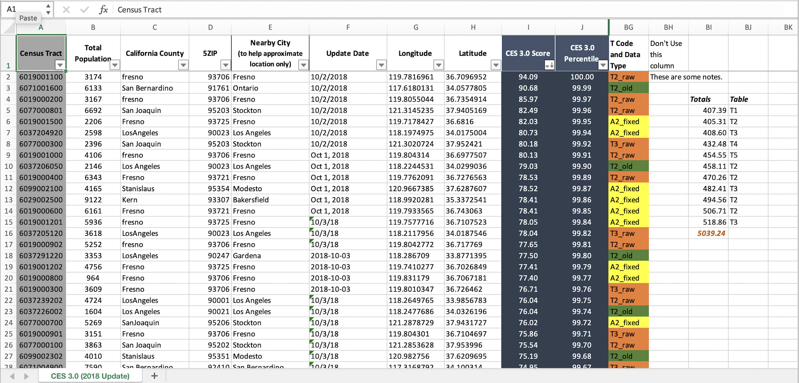

```{r setup, include=FALSE, purl=FALSE, message=FALSE}

library(knitr)
suppressPackageStartupMessages(library(tidyverse))
options(scipen = 25)

```

::: {.obj}
**Learning objectives**

-   Understand what messy data is and how to avoid it
-   Understand how to effectively use spreadsheets 
-   Learn the difference between wide and long data, and how to pivot between wide and long formats 
:::

# Spreadsheets

Spreadsheets have been woven into nearly every facet and field, and although they are meant to make our lives easier, it is typical to spend lots of time untangling the data [mis]adventures they create.

However, a few simple tips on how to structure and use spreadsheets can make all the difference. There will still always be messy datasets to face, but learning how to more effectively use spreadsheets *will* make life easier and more reproducible, and hopefully make these encounters less daunting.

Let's go over what tidy data should look like, how to wrangle a messy real-life spreadsheet, and how to understand the difference between human readable and computer readable information.

# What is Tidy Data?

Ultimately spreadsheets (or any list or table of data) attempt to take **human readable** data and turn it into ***computer readable*** data. The problem is humans often like to add information that is only **human readable** (i.e., colors in spreadsheet). These bits of "flair" may be nice to visualize things, but computers can only interpret the literal pieces of data in each cell of a spreadsheet, so if we want additional information to be converted (like color, or what it represents), we need to store that information in a **computer readable** context.

Typically when we look at data, we want it to be in a "tidy" format. Data in a tidy format, means that each **column** is a unique variable, and each **row** is a unique observation of data. Furthermore, any information we want the computer to retain should be stored as `variables` and not in side comments or coloring. This makes it possible for a computer to easily interpret these data, and avoids any unnecessary conversions or loss of data.

(ref:tidyData1) *Illustrations from the Openscapes blog Tidy Data for reproducibility, efficiency, and collaboration by Julia Lowndes and Allison Horst*

```{r tidydata, echo=FALSE, fig.cap="(ref:tidyData1)"}
include_graphics("images/tidydata_1.jpg")
```

## Dealing with Messy Data

In reality, we will generally encounter non-tidy data in the wild. Messy data comes in many forms and it exists *everywhere*. Much of data science hinges on cleaning up and reformatting data so it can be used in some way other than the form it exists in. The good news is the concept of tidy data can be applied to *any* dataset, and there are some very straightforward tips to make this easy to implement!

(ref:tidyData2) *Illustrations from the Openscapes blog Tidy Data for reproducibility, efficiency, and collaboration by Julia Lowndes and Allison Horst*

```{r tidydata2, echo=FALSE, fig.cap="(ref:tidyData2)"}
include_graphics("images/tidydata_2.jpg")
```

## Same Tools, Different Data

The great news is we can use a similar set of tools to deal with tidying and cleaning our data, and once we've learned these tools, there are few datasets that will stand in your way (though some may take longer than others!). An important thing to learn is that ***tidy data starts the moment we begin recording information***. The more we can collect and update data in a "*tidy*" fashion, the less cleaning and wrangling is required to work with that data.

(ref:tidyData3) *Illustrations from the Openscapes blog Tidy Data for reproducibility, efficiency, and collaboration by Julia Lowndes and Allison Horst*

```{r tidydata3, echo=FALSE, fig.cap="(ref:tidyData3)"}
include_graphics("images/tidydata_3.jpg")
```

## Understanding Messy Spreadsheets

An important step towards tidy data is learning to quickly spot where data is *messy* and what needs to be fixed.

Let's take a look at the **messy** spreadsheet data which we downloaded from this [repository](https://github.com/r4wrds/r4wrds-data-intro/), unzipped, and can now be found in our project here: `data/calenviroscreen/ces3results_messy.xlsx`. These data are based on data from the [Calenviroscreen data](https://oehha.ca.gov/calenviroscreen) from previous modules.

<br>

```{r messytab, echo=FALSE, out.width='100%', preview = TRUE}



```

<br>

::: {.challenge}
**CHALLENGE 1**

-   **What issues do you notice about this spreadsheet?**
-   **What could we do to make this tidy?**
:::


<details>

<summary class="challenge-ans-title">**Click for Answers!**</summary>

<div class="challenge-ans-body">

-   Multiple tables on one sheet

-   Multiple variables in a single column (see `T Code and Data Type`)  

-   Tables start on different rows

-   Different date formats

-   Different county spellings (see `California County`)

-   Color encoding

</div>

</details>

<br>

<details>

<summary class="extra-practice-title">Extra Practice</summary>

::: {.extra-practice-body}
*If you are interested in an excellent lesson on how to improve your spreadsheet skills, checkout the excellent lesson via [Data Carpentry: Data Organization in Spreadsheets for Ecologists](https://datacarpentry.org/spreadsheet-ecology-lesson/). This lesson should be read by anyone and everyone who uses spreadsheets (which is everyone), so go take a look!*
:::

</details>


# Spreadsheet Best Practices

If you have to work with a multi-tabbed spreadsheet (which we all do at some point), there are some basic rules/tips that can save you and anyone else that needs to work with the same spreadsheet. We also recommend checking out White et al. 2013^[ [White, E. P., E. Baldridge, Z. T. Brym, K. J. Locey, D. J. McGlinn, and S. R. Supp. 2013. Nine simple ways to make it easier to (re)use your data. Ideas in Ecology and Evolution 6.](https://ojs.library.queensu.ca/index.php/IEE/article/view/4608) ] and Broman and Woo 2018^[ [Broman, K. W., and K. H. Woo. 2018. Data Organization in Spreadsheets. The American Statistician 72:2–10](https://doi.org/10.1080/00031305.2017.1375989) ].

## Keep Raw Data `RAW`

Any raw data you have should always stay **raw** so you can always go back and "reproduce" your analysis. The danger with spreadsheets is its easy to change things with a few clicks and overwrite the raw data, and have no record of what you did. 

So no matter what shape the data is in, it's always advisable to make a copy of the tab with the data, append or prepend "RAW" to the tab name, and *lock* the tab so the data can't be deleted or altered. To do this:

 - right click on the tab and select **`Move or Copy`**
 - check **`Create a Copy`** box
 - right click on the newly copied tab and select **`Rename`** and add `RAW`
 - right click on the `RAW` tab again, and select **`Protect Sheet`**
 - the only two boxes that should be checked are `Select locked cells` and `Select unlocked cells`. Click `OK` and save!


```{r messytab2, echo=FALSE, out.width='100%'}

include_graphics("images/messy_spreadsheet_2.png")

```

## Record what you did with `README` tab

While programming languages like `R` allow us to write scripts or code that record every step of the process, spreadsheet programs use an interface based on points and clicks. It's easy to forget what we clicked on or what we did as we begin to clean/work with our data. An easy solution which your future self (or future collaborators) will thank you for is adding a **`README`** tab! This is where you can write notes about what things have been done to the data, ideally with sufficient information that future you or someone else would be able to reproduce your analysis or cleaned dataset by reading the **`README`**.

```{r messytab3, echo=FALSE, out.width='80%'}

include_graphics("images/messy_spreadsheet_3.png")

```

## Date Standards

Perhaps one of the most frustrating and frequent data snafus you may encounter is how dates or datetimes get formatted. An entire lesson could be devoted to dealing with datetime data, but we can simplify it to one rule: **keep dates formatted using the world standard^[See the [ISO 8601](https://xkcd.com/1179/) standard.] of YYYY-MM-DD**. Better yet, in spreadsheets, split the date into unique columns for Year, Month, and Day. It's straightforward to paste these back together and format them in R, and because they are then stored as simple integer values there will be no missed translations between people or computers. 

<aside>
The [Dates and Times lesson](https://r4ds.had.co.nz/dates-and-times.html#creating-datetimes#from-strings) from R4DS by H. Wickham & G. Grolemund is an excellent overview on dates and times. Does every minute always have 60 seconds?
</aside>

```{r datestands, echo=FALSE, out.width='80%', fig.retina=2}

include_graphics("images/datestandards_global.png")

```

## Keep one table per tab

With spreadsheets, it is tempting to add additional summary tables in the same tab you may be working in, or paste another table into the sheet your are working so you can calculate something using a formula. When these data need to be read in by another program (e.g., R), a computer program cannot interpret the visual space our eyes may see between tables as an indication that these tables are separate. Computers are literal, and thus every sheet or tab will always be interpreted as one table by the computer. Follow *tidy data* principles and keep one table for every sheet. It makes import and export simpler, and in reality tabs are cheap (as are columns). When in doubt, keep things separate and clearly delineated in a way that is both **computer readable** and **human readable**. This includes figures...resist the temptation to include figures in a spreadsheet with a table. Keep them separate!

## Don't Merge or Color Data

Please don't merge cells. Just don't. It creates many issues that are outlined above, and generally requires significant data wrangling to "untangle" merged data. Merging cells is generally reserved for creating a final table in a word document for display purposes only.

And while using colors can be fun, remember these data are only **human readable**. Add a new column variable to encode these data. It's rare that you will run out of space for new columns or rows, but common that data encoded visually will be forgotten or misinterpreted.

## Missing Data or `NA`

Remember, computers are literal, thus any blank cell will be interpreted as *missing data* or **`NA`** by the computer. Use this to your advantage! It's preferable to have consistent designation of **`NA`** (i.e., blank cells) instead of using things like `"No data"` or `-999`. These are common ways to encode missing values, but they introduce different problems when trying to analyze or filter the data later.  Using a character string like `"No data"` may unintentionally convert all the data to a `character` class when imported into R when it is actually numeric or integer (see [module on data structures](m_data_structures.html)). If using a numeric value for `NA` like `-999`, the computer will interpret these as numbers, and it may be easy to miss or include these data in downstream analyses.

<aside>

Typos happen. Imagine the issues that arise when a number used to signify `NA` gets mistyped. Now you need to find all `-99`, `-999`, and investigate any `99` numbers. Was there a typo or is this data?

</aside>

Although there is a potential risk to accidentally add a space in a blank cell, the simple and easiest approach for missing or `NA` data is to leave cells blank. This is generally and consistently interpreted as a missing value by computer programming languages and avoids the need to remember which code was used to signify `NA`. This also means that a **`0`** is a **`0`**. Any data that is **`0`** should be encoded as such, and not left blank.


# Pivoting

When we enter data in a spreadsheet, the data is typically oriented in a ***wide*** format. This makes entry easier and is generally easier for us to see, enter, and explore the data. Although ***wide*** data is more human-friendly for data entry, ***long*** data is much better for analysis and visualization. In particular, in `R`, the `{ggplot}` package prefers data in a ***long*** format, which facilitates easier filtering, grouping, and faceting of the data.

## Wide to Long

Let's use the [**`ces3results.xlsx`**](https://github.com/r4wrds/r4wrds/blob/main/data/calenviroscreen/ces3results.xlsx?raw=true) [CalEnviroscreen data](https://oehha.ca.gov/calenviroscreen), which we can read in and look at the column names and data types. By default, `read_xlsx()` reads in the first sheet. See the [import and export module](m_importing_and_exporting_data.html) for more details.

```{r import-excel, warning=FALSE}
library(readxl)
ces <- read_xlsx("data/calenviroscreen/ces3results.xlsx")
str(ces)
```

Note the different data classes (`num`, `chr`, etc). Even though all columns between `Ozone` and `Pop. Char. Pctl` should be numeric, there are a number of "`chr`" or *character* data. This is because one of the issues with messy spreadsheets we discussed above. If we were to open the spreadsheet and scroll down through these columns, we may notice there are `NA`'s sprinkled throughout. When importing these data into R, those `NA` are interpreted as character class, and thus the entire column of numeric data is converted to a character class. 

We know these data should all be numeric, so let's fix this using some `dplyr` knowledge and a cool function called `across()`. This allows us to apply a function over many columns in a dataset, and it can be used in `mutate()` or `summarize()`.

<aside>

Note, we need to use backticks for \``column names`\` because there are spaces and characters in our column names that aren't permitted by default in R. Tidy column names are helpful for this. See the excellent [`{janitor}`](http://sfirke.github.io/janitor/) package for more info.

</aside>

```{r dplyr-across}

ces <- ces %>% 
  mutate(across(c(`Ozone`:`Pop. Char. Pctl`), as.numeric))

```

(ref:across) *Illustration by @allison_horst*

```{r across, echo=FALSE, out.width="%80", fig.cap="(ref:across)"}
include_graphics("images/dplyr_across.png")
```


The warnings are ok! They are saying `NAs introduced by coercion` which essentially means when converting these data from character to numeric, the `NA` text is being converted to an actual **`NA`** that R can use. Ok, now let's look at the size of this dataset. 

```{r excel-data-1}

ncol(ces) # number of columns
nrow(ces) # number of rows
```

So, if we want to reformat or `pivot` this data from a wide format (there are `r ncol(ces)` columns, many of which are distinct variables measured as part of the CES calculation), we want to retain certain columns and collapse others. Let's focus on collapsing all the columns that are used to calculate the CES scores into a single column. So from `Ozone:Pop. Char. Pctl`, we should have one column we'll call `CES_variables` which will be all the various variable names from these columns, and a `CES_value` which will be the value associated with each of the columns we are collapsing or combining. We need the `{tidyr}` package for this, which is loaded as part of the `{tidyverse}`.

```{r pivot-long, warning=FALSE}

library(tidyr)
ces_long <- pivot_longer(data = ces,
                         # the columns we want to pivot
                         cols = c(`Ozone`:`Pop. Char. Pctl`),
                         # name of column we create for pivoted col names above
                         names_to = "CES_variables",
                         # name of column we create for pivoted values
                         values_to = "CES_values")
                          
dim(ces_long)

str(ces_long)
```

Wow! We just condensed our dataset from wide to long by collapsing 46 variables into a single column. That means there is some duplication in the data, but these data will be much easier to work with in {`ggplot`} or other downstream analyses in R. We can double check this worked as expected, because the original wide dataset had `r nrow(ces)` observations, so if we multiply `r nrow(ces)` * 46 variables, we should get the total number of observations in the `ces_long` dataset (n=`r nrow(ces)*46`).

## Long to Wide

If we want to do the opposite, and provide these data for folks to add additional variables or enter data, we can use `pivot_wider()`. Similar to `pivot_longer()`, we need to specify our columns of interest for the names, and column of interest for the values.

```{r pivot-wide}

ces_wide <- pivot_wider(data = ces_long,
                        names_from = "CES_variables",
                        values_from = "CES_values"
                        )

```


There are many additional options within the {tidyr} `pivot_` functions. We recommend further reading on [*pivoting at R4DS*](https://r4ds.had.co.nz/tidy-data.html#pivoting) and the [*`{tidyr}` pivoting vignette*](https://tidyr.tidyverse.org/articles/pivot.html), as well as checking out the `separate()` and `unite()` functions from the same package.

Happy wrangling!

(ref:tidyData6) *Illustrations from the Openscapes blog Tidy Data for reproducibility, efficiency, and collaboration by Julia Lowndes and Allison Horst*

```{r tidydata6, echo=FALSE, fig.cap="(ref:tidyData6)"}
include_graphics("images/tidydata_6.jpeg")
```


<br> 

<link rel="stylesheet" href="https://maxcdn.bootstrapcdn.com/bootstrap/4.0.0/css/bootstrap.min.css" integrity="sha384-Gn5384xqQ1aoWXA+058RXPxPg6fy4IWvTNh0E263XmFcJlSAwiGgFAW/dAiS6JXm" crossorigin="anonymous">

<a href="m_dplyr.html" class="btn btn-secondary" style="float: left">Previous module:<br> 7. Data Wrangling</a>
<a href="m_functions.html" class="btn btn-secondary" style="float: right;">Next module:<br> 9. Functions</a>  
