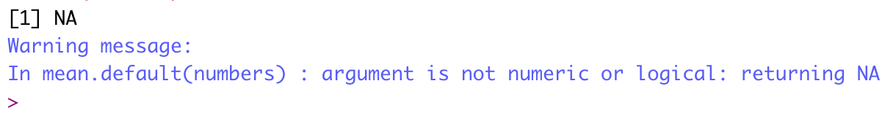
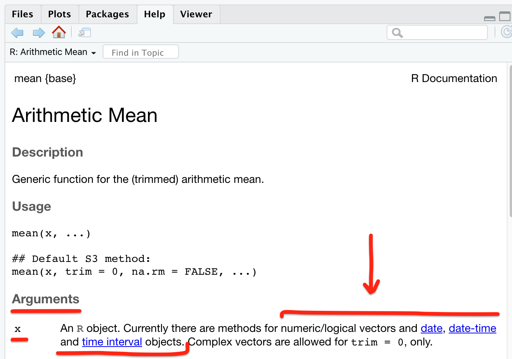
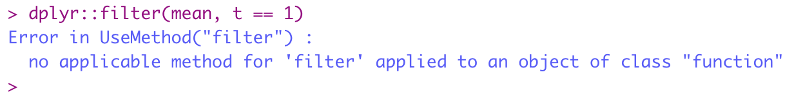
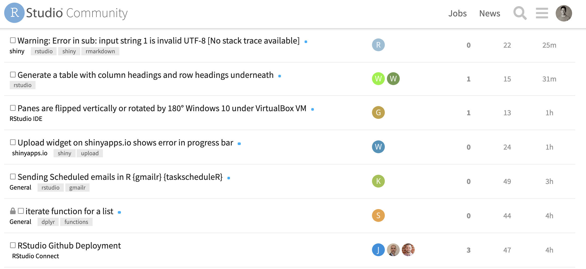
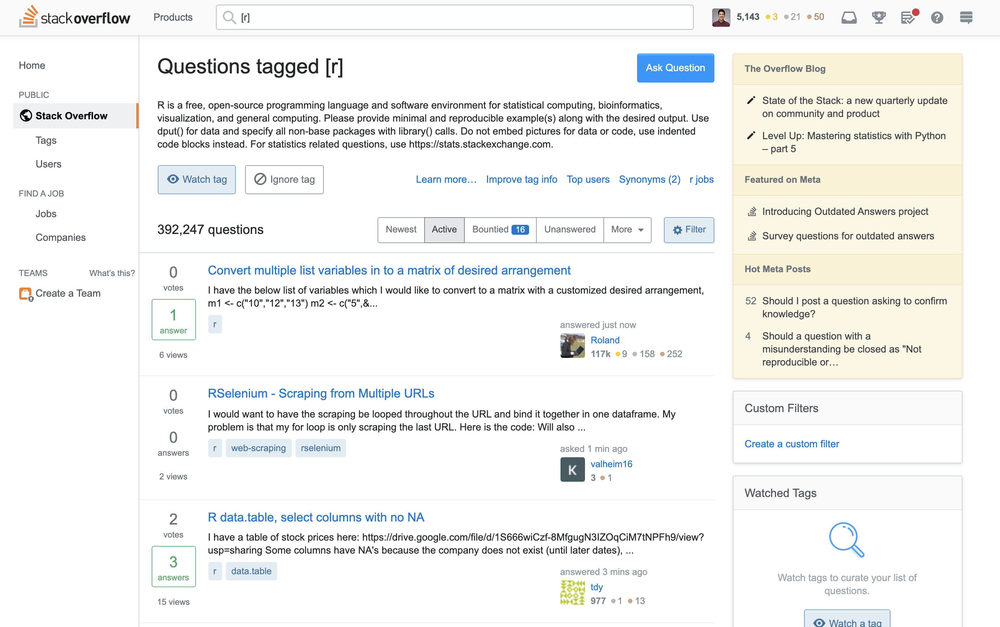

```{r setup, include=FALSE, purl=FALSE, message=FALSE}

library(knitr)

```

:::obj

**Learning objectives**

 - Interpreting error messages 
 - Understand classes
 - Using built-in help  
 - Reading R help documentation
 - Minimal, reproducible example
 - How to search for answers and ask questions


:::


## Error messages

<!-- <aside> -->
```{r bryan-aside, out.width='80%', echo=FALSE, fig.cap = "[Jenny Bryan's rstudio::conf(2020) talk](https://www.youtube.com/watch?v=vgYS-F8opgE) is a comical and educational deep dive into debugging."}
knitr::include_graphics("images/bryan_try_again.png") 
```
<!-- </aside> -->

Interpreting error messages is a normal part of working with R. Getting errors is expected, and no amount of practice will prevent errors from happening. What practice **will change** however, is your ability to diagnose and address errors. In this module, we cover a few seasoned approaches to "get unstuck" when you encounter errors in R.

```{r error-message, out.width='80%', echo=FALSE, fig.cap = "The fabled error message: '`object of type 'closure' is not subsettable`'. This hard-to-interpret error arises when we try to subset an object that can't be subset. In this example, the function `mean()` doesn't have an index `[1, ]` so we get this opaque error."}
knitr::include_graphics("images/closure-error.png") 
```


## Class

In R, every object has a **class**, which defines the operations we can perform on it. We can check the class of an object with the `class()` function. 

<aside> Recall the classes of atomic vectors (logical, numeric, factor, character) from the [module on data structures](m_data_structures.html#basic-object-classes). </aside>

```{r class, message=FALSE, warning=FALSE}
library(tidyverse)

# check the class of the function, "mean"
class(mean)

# check the class of other objects we've seen before
class(1:10)
class("a string")
class(tibble(x = 1:10, y = "a string"))
```

Knowing the class of the objects you're working with can help orient questions you may ask online, and will also help you interpret built-in documentation.  


## Using built-in help

One of the best features about R is the standardized package documentation. Once you learn how to interpret package documentation, you'll be able to read about functions in any package and learn what arguments they take, the class of arguments they expect (incorrect objects passed to functions is a common error), and the object and object class they output. 

To illustrate, below is an example of an error that we can diagnose by consulting the help for `?mean`.

```{r mean-error, eval = FALSE}
numbers <- c("10", "50", 100)
mean(numbers)
```

```{r, echo = FALSE}
numbers <- c("10", "50", 100)
```


```{r mean-error-img, out.width='80%', echo=FALSE,}

```

The help for `mean` (enter `?mean` in the console) indicates that the Argument `x` only has methods for numeric/logical vectors, and date, date-time, and time interval objects.  

```{r mean-help, out.width='80%', echo=FALSE,}

```

What is the class of our object `numbers`?

```{r class-numbers}
class(numbers)
```


We tried passing a character string to `mean()` but there are no methods defined for strings, which led to an error. By checking the help and the class of the object, we were able to diagnose this problem. The fix is to change the class of the object to a numeric vector, which `mean()` supports according to the help documentation.

```{r class-change}
# change the class of the numbers object from character to numeric
numbers <- as.numeric(numbers)

# take the mean - this now works!
mean(numbers)
```


## Reading R help documentation

R help documentation is standardized, and thus predictable. Let's cover the anatomy of R help documentation, discussing each of the key sections and how to interpret them. As before, below is the help documentation for the function `?mean`:  

```{r help-anatomy, out.width='80%', echo=FALSE,}
knitr::include_graphics("images/help_anatomy.png")
```

<br> 

Once you understand this predictable structure of help documentation, you can interpret the documentation for new functions and expand your R vocabulary! This structure is the same across different R packages. From top to bottom, these sections can be interpreted as follows: 

<br>

|label | interpretation |
|------|----------------|
|`mean {base}` | Function name {package}  |
|`Arithmetic Mean` | Short function description |  
|`Description` | More detailed function description  |
|`Usage` | Function usage, showing the name and order of arguments  |
|`Arguments` | Description of the arguments taken by the function  |
|`Value` | Description of what the function returns |
|`References` | Citation or further documentation associated with the function |
|`See Also` | Related functions |
|`Examples` | Working examples to copy and paste that demonstrate the function in action |

<aside> Although the table to the left is based on the help for a **function**, some packages ship with **objects** like `data.frame`s that also have documentation. These objects don't have Arguments or a Value, since unlike functions, they don't take inputs and create outputs. For example, see the built-in dataset `?rivers`. </aside>

:::challenge

<font color="#009E73">**Challenge 1**</font> 

1. Read the help for the `ggplot` function from the `{ggplot2}` package. 
    - Hint: try using **`?ggplot2::ggplot`.** Here the "**`::`**" allows us to specify a *`{package}::{function}`*
2. Read the help for two functions from `{dplyr}`: `mutate` and `filter`. Are there other packages with a `filter` function? How do you know?
3. Read the help for two other functions you've encountered in this course.  

:::

<br>

## Minimal reproducible example

More often than not, errors you encounter will not be the result of using the `mean()` function incorrectly, but due to unwieldy, large, and complicated data processing steps strung together. Sometimes, the sheer amount of data you want to process may be so large that it takes minutes until your code finally errors, and it becomes time-consuming to debug.

<aside> There's even an [R package](https://reprex.tidyverse.org/articles/reprex-dos-and-donts.html) designed to help R users create reprexes. Many people have weighed in on the best way to create a reprex, including the developer of many of the R packages you've used in this course, who shares [their thoughts here](https://gist.github.com/hadley/270442). </aside>

A tried and true approach to solving errors is to create a **minimal, reproducible example**, or a **reprex** for short. 

According to Hadley Wickham,  

> There are four things you need to include to make your example reproducible: required packages, data, code, and a description of your R environment.

Thus, we can think of a reprex in terms of:  

1. **Packages**: loads all needed packages at the top of the script.  
2. **Data**: Uses a minimal dataset to capture the scope of the problem, so that the code solution can scale to the entire dataset later. Uses a dataset that everyone has access to. If not using a built-in dataset like `mtcars`, use `dput()` to "dump" your data into a form that can be copy/pasted and assigned to a variable.  
3. **Code**: Concisely describes the expected output and shares a minimal code example highlighting the error using the minimal data.  
4. **Environment**: If you're sharing the reprex with others, run `SessionInfo()` in the console and copy/paste this into your reprex. Some errors can be diagnosed by looking at this information. 

You may create your reprex with the intention of sharing it with others, but find that in creating it, you actually solve your problem! That is not uncommon. The exercise of boiling a problem down to its most essential parts often sparks new ways of approaching a problem and seeing it for what it really is.  


## Searching for answers and asking questions

Sometimes, knowing how to check object classes, read help documentation, and abstract your code's error into a minimal, reproducible example just isn't enough to solve the problem. Even the best programmers reach this point, and when you too reach this point, you'll probably turn to the internet for answers. Here we present some guidance on *how* and *where* to ask questions and seek answers.

```{r code-hero, out.width='80%', echo=FALSE, fig.cap = "Learning to code doesn't need to be a solitary experience. Online and in-real-life comunities of practice can support you on your jouRney. Artwork by @allison_horst"}
knitr::include_graphics("images/code_hero.jpg")
```


### Google

Say you encountered this error:  

```{r error-filter, out.width='80%', echo=FALSE}

```

```{r r-error, out.width='80%', echo=FALSE, fig.cap="Embrace the error message! It may even tell you something useful. Artwork by @allison_horst"}
knitr::include_graphics("images/r_error.jpeg")
```

When you use Google as a jumping off point to search for R help, follow this formula:

> **[R] + [package name] + [object type] + [error]**

```{r error-google, out.width='80%', echo=FALSE, fig.cap = "Authoratitive answers to R programming errors are out there in the wild, and these webpages will usually have the following information: R, package name, object type, error message."}
knitr::include_graphics("images/error_google.png")
```

You may find posts on any number of sites including community.RStudio, Stack Overflow, listservs, package documentation, blog posts, or otherwise. 

If you're having an error, chances are someone else has had the same problem before and you can solve your problem just by asking the right question. Take note of the date that a post was written, and whenever possible, try to find and read more recent answers first. Sometimes there may be answers available but because they were written many years ago, they are applicable to much older versions of R, or out-of-date packages and functions.

If you're *still* unable to find an answer by reading, the next thing to do is create a reprex and ask a question. When doing this, we recommend two places to ask questions.


### [community.RStudio](https://community.rstudio.com/latest)

[community.rstudio.com](https://community.rstudio.com/latest) is a beginner-friendly, safe space to ask questions and learn. Unlike Stack Exchange Sites (e.g., Stack Overflow, Cross Validated, and GIS Stack Exchange), community.RStudio is exclusively for R-based help.

It's free to create a user account and post questions in the forum. Present your problem in the form of a [reprex](#minimal-reproducible-example) -- this will enable others to help you, and is the form of question most likely to receive help. People answering questions on the site generally want to help. Your job is to make it as easy as possible for them to copy/paste your code into their environment so they can take a crack at your error.  

```{r community-rstudio, echo=FALSE, fig.cap = "[community.rtudio.com](https://community.rstudio.com/) is an online question and answer site for R questions."}

```


### StackOverflow

Stack Overflow is an online question and answer site for programming questions of all kinds -- you can find questions and answers in just about every language, and its extensive use makes it the de facto hub for finding old posts that may address your error. Like community.RStudio, you can sign up for a free account to ask and answer questions. 

Stack Overflow can be a more intimidating place to ask questions, especially because the structure of the site allows users to upvote and downvote questions. Beginners who don't ask questions in the form of a reprex are often downvoted, and this can feel discouraging.

Upvotes and downvotes influence a user's "Reputation" and over time, users can accumulate "Reputation" points to remove ads, unlock moderation privileges, and even put bounties on questions to draw more attention to them. 

Don't be afraid of Stack Overflow. The majority of people who frequent the site are genuinely curious people who like solving coding problems, and it's a great way to share a tough problem you're stuck on and have people across the world try to solve it. The instructors of this course have learned so much from spending time on Stack Overflow. 

When posting a question on Stack Overflow, follow these tips to ensure a positive response:  

1. Do research to make sure the same question hasn't already been asked, otherwise, it may be downvoted or closed.  
2. If your question is novel, be sure to ask it in the form of a [reprex](#minimal-reproducible-example) to enable others to actually work on your problem. This is the expectation from more senior site users.  
3. Thank others for expressing interest in your question by upvoting helpful answers and comments.  
4. If a legitimate answer to your problem is posted, thank the person by "Accepting" their answer with the green check mark. This rewards the person with "Reputation" points for solving your problem, it rewards you with "Reputation" points too, and it directs the attention of future visitors to the page to the "Accepted solution".

```{r stackoverflow, echo=FALSE}

```

Stack Overflow is for general programming questions, but you may find that your question is more statistical or geospatial in nature. In these cases, associated Stack Exchange sites for statistics ([Cross validated](https://stats.stackexchange.com/)), geospatial ([GIS Stack Exchange](https://gis.stackexchange.com/)), and [other topics](https://stackexchange.com/sites) are great places to seek out domain-specific expertise.


<br>  

<link rel="stylesheet" href="https://maxcdn.bootstrapcdn.com/bootstrap/4.0.0/css/bootstrap.min.css" integrity="sha384-Gn5384xqQ1aoWXA+058RXPxPg6fy4IWvTNh0E263XmFcJlSAwiGgFAW/dAiS6JXm" crossorigin="anonymous">

<a href="m_intro_Rmarkdown.html" class="btn btn-secondary" style="float: left">Previous module:<br> 13. RMarkdown</a>
