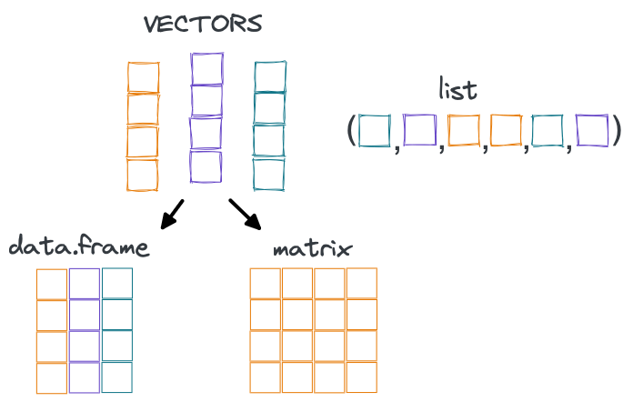

---
### Click the RUN DOCUMENT 
### (the green "Play" button") in RStudio to run worksheet!
title: "Data Structures"
author: "R. Peek"
output: 
  learnr::tutorial:
    df_print: default
runtime: shiny_prerendered
---

```{r setup, include=FALSE}
library(learnr)
library(here)
library(tidyverse)
knitr::opts_chunk$set(echo = FALSE, comment = "")
stations <- read.csv(here("https://github.com/r4wrds/r4wrds/blob/main/intro/data/gwl/stations.csv?raw=true"))
matrix1 <- c(1,2,3,4,5,6,7,8,9)
matrix1 <- matrix(matrix1, nrow=3,ncol=3,byrow=TRUE)
```

<br>

This worksheet will help you work through some examples of different data classes and structures and how we can use them. 

You can write code into the code boxes and click the "**Run Document**" box to interact or answer the prompts. Some boxes may have __*Hints*__, click the box to find out more!

# Data Classes and Structures

Programming is essentially the conversion and storing of data in a way that a computer can interpret or manipulate. The following data classes are found in the `R` language, but there are similarities with many other coding languages too.

There are really only a few main data classes and structures we need to know in R. It is important to know these basic building blocks of data. 


```{r datafig, eval=TRUE, echo=FALSE, fig.align='center', out.width='90%'}



```

## Vectors

 - Vectors are the building blocks of data frames, each vector is really a column in the data frame.
 - There are 2 types of vectors, atomic (all the same type of data or homogeneous) and lists (which can be heterogeneous).
 - There are 4 primary types of atomic vectors (**logical**, **integer**, **double**, **character**). Integer and double are both **numeric** types.


```{r quiz1}
quiz(
  question("Which of the following are atomic vector **`classes`** in R?
",
    answer("numeric (integer or double)", correct = TRUE),
    answer("date"),
    answer("factor"),
    answer("logical", correct = TRUE),
    answer("character", correct = TRUE)
  ),
  question("Are atomic vectors made of homogenous or heterogenous data?",
    answer("homogenous", correct = TRUE),
    answer("heterogenous")
  )
)
```

<br>

There are a few other vector types that build on atomic vectors. These are **`dates` & `date-times`** (stored as a numeric value) and **`factors`** (code a character value as a numeric value).

## Dataframes

Let's use our stations data from the [lesson on data structures](https://www.r4wrds.com/intro/m_data_structures.html). An important point about data frames: they consist of **rows** of heterogeneous data and **columns** of vectors (homogeneous data classes). So dataframes are overall a heterogeneous type of data because they can include several different types of data.

Here's our groundwater `stations` dataset.

```{r}

stations <- read.csv(here("https://github.com/r4wrds/r4wrds/blob/main/intro/data/gwl/stations.csv?raw=true"))

```

Let's look at the data classes of each **vector** in the data frame:

```{r, echo=TRUE}
str(stations)
```

How do we access a single *vector* or column of our dataframe? Remember in R the rows and columns can be queried using brackets with the number or numbers of interest inside (`[rows, columns]`), or via a `$`.

How many different data classes are there in the first 10 columns? Go ahead and complete this code to check.

```{r check-classes, exercise = TRUE}

str(stations[ ___ ])

```


```{r check-classes-hint}

str(stations[ , 1:___ ]) # specify all rows and columns 1: ? 

```

```{r check-classes-solution}

str(stations[ , 1:10 ]) # specify all rows and columns
# so looks like 3 data classes!
```

What if we wanted to check a single column class? Let's try to check `WELL_NAME` and `WELL_DEPTH`. There are a few ways to do this...

```{r check-classes-single, exercise = TRUE}

# check class of WELL_NAME & WELL_DEPTH
class()

```


```{r check-classes-single-hint-1}

class(stations$___)

```

```{r check-classes-single-hint-2}

class(stations[___ , ___])
class(stations[[___]])

```

```{r check-classes-single-solution}

class(stations[, c("WELL_NAME")])
class(stations[[4]])
class(stations$WELL_NAME)

```


## Matrix

A matrix is a bit different because it is **homogeneous**. That is, all the data classes *must* be the same within the matrix. Typically, all numeric or all character. The default way to access a matrix assumes we are operating `column-wise` instead of `row-wise`. Check out the `matrix()` function top learn more (`?matrix()`)

Here's a matrix we can use to play with

```{r matrix-integer, echo=FALSE}
matrix1 <- matrix(sample.int(15, size = 25*10, replace = TRUE), nrow = 25, ncol=10)
matrix1

```

How do we access the element at the 3rd row and second column?

```{r matrix-integer-ex1, exercise=TRUE}

matrix1[___]

```


```{r matrix-integer-ex1-solution}

matrix1[3, 2]

```

<br>

What about if we wanted to access the first three rows of our matrix?

```{r matrix-integer-ex2, exercise=TRUE}

# select the first three rows of the matrix
matrix1[___]

```


```{r matrix-integer-ex2-hint}

# remember we can use a colon (:) to indicate a range of numbers
print(1:3)

```


```{r matrix-integer-ex2-solution}

# select rows 1:3 and all columns
matrix1[1:3, ] # all columns

```
