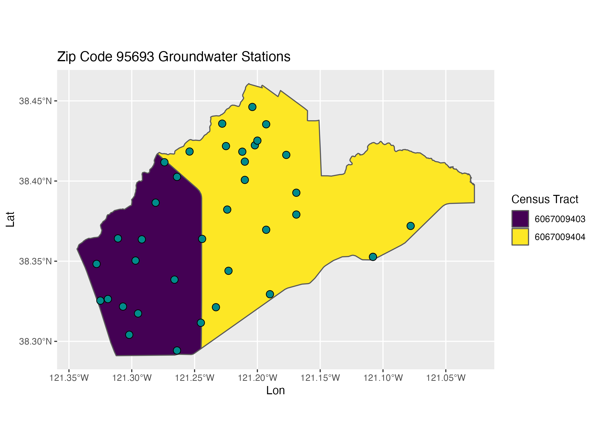

---
### Click the RUN DOCUMENT 
### (the green "Play" button") in RStudio to run worksheet!
title: "Data Wrangling"
author: "R. Peek"
output: 
  learnr::tutorial:
    df_print: default
runtime: shiny_prerendered
---

```{r setup, include=FALSE}
library(learnr)
library(here)
library(tidyverse)

knitr::opts_chunk$set(echo = FALSE, comment = "")
stations <- read_csv("https://github.com/r4wrds/r4wrds/raw/worksheet-wrangling/intro/data/calenviroscreen/sac_county_crosswalk_to_gw_stations.csv")


```

<br>

This worksheet will help you work through some examples of some common data wrangling skills you may need to use. In particular, how to work with different types of data, join them, and summarize them.

You can write code into the code boxes and click the "**Run Document**" box to interact or answer the prompts. Some boxes may have __*Hints*__, click the box to find out more!

# Data Wrangling

At the root of most data science is the need to pull or import different types of data onto your computer, do something with that data to clean and summarize it, and then save the updated dataset for visualization and reporting. This process is repeated everywhere, and there are often many approaches and tools we can use. Let's focus on an example of pulling some spatial data and a spreadsheet to compare and contrast data.

## Import Data

We covered a number of different ways to import data in R in the lesson on [importing and exporting data](https://www.r4wrds.com/intro/m_importing_and_exporting_data.html).

Let's import or download a `csv` from a web path, and a shapefile from a zipped file, bring both into our R environment, and do some tidying.

If we know a webpath, how do we use it to import our data with the `read_csv` function?

```{r get-stations, exercise = TRUE}

webpath <- "https://github.com/r4wrds/r4wrds/raw/worksheet-wrangling/intro/data/calenviroscreen/sac_county_crosswalk_to_gw_stations.csv"

stations <- read_csv(___)

```

```{r get-stations-hint}

webpath <- "https://github.com/r4wrds/r4wrds/raw/worksheet-wrangling/intro/data/calenviroscreen/sac_county_crosswalk_to_gw_stations.csv"

stations <- read_csv(file = ___)

```

```{r get-stations-solution}

webpath <- "https://github.com/r4wrds/r4wrds/raw/worksheet-wrangling/intro/data/calenviroscreen/sac_county_crosswalk_to_gw_stations.csv"

stations <- read_csv(webpath)

```

Once we have our data, let's inspect it a bit more.

```{r}
glimpse(stations)
```

 - How many `unique` stations (`STN_ID`) are in this dataset? 
 - How many `distinct` `ZIP` codes are in this dataset?
 - Which `ZIP` code has the most stations?

```{r sta-query, exercise = TRUE}

length(unique(stations$STN_ID)) # n = 494
stations %>% distinct(STN_ID) %>% tally() # same!

stations %>% distinct(ZIP) %>% tally() # same!

stations %>% group_by(ZIP) %>% tally() %>% 
  arrange(desc(n))

```

```{r sta-query-hint-1}

# two ways to get the unique or distinct
unique(___) # how do we count how many are in this list?

```

```{r sta-query-hint-2}

# can count the length of a vector with length
length(unique(___))

# using a dplyr approach
stations %>% distinct(___) %>% tally() 

```


```{r sta-query-solution}

stations %>% distinct(ZIP) %>% tally() # same!

```

To answer the third question, which zip code has the most groundwater stations present, we need to sort our data somehow from largest (the most) to smallest (fewwest) number of groundwater stations per zip code.

```{r sta-query2, exercise = TRUE}

stations %>% group_by(___) %>% 
  tally() %>% 
  arrange(___)

```

```{r sta-query2-hint-1}

stations %>% 
  group_by(ZIP) %>% 
  tally() %>% 
  arrange(___(n))

```

```{r sta-query2-solution}

stations %>% 
  group_by(ZIP) %>% 
  tally() %>% 
  arrange(desc(n)) 
# so top row in this is ZIP 95693 with 37 stations.


```

## Shapefiles

We want to import a shapefile (currently zipped, but accessible at the link below). If you want this data, you can copy the code below to download and save it to your computer directly. These data are also already part of the unzipped data folder from previous lessons.

If you want to recreate the data yourself, you can try the code below.

```{r download-sf, echo=TRUE, eval=FALSE}

# make a dir if it doesn't exist
dir.create(here("worksheets"), showWarnings = TRUE)

# download (change destfile to local dir in your project!)
download.file(url = "https://github.com/r4wrds/r4wrds/raw/worksheet-wrangling/intro/data/calenviroscreen/CES3_shp.zip", destfile = "worksheets/CES3_shp.zip")

# unzip to dir of your choice with "exdir"
unzip("worksheets/CES3_shp.zip", exdir = "worksheets")

# read and write data back out:
library(sf)
shpfile <- st_read(here("worksheets/CES3_shp/CES3June2018Update.shp"), quiet = TRUE) %>% 
  # we need this line so data in this layer
  # will plot in the same space as our station data.
  st_transform(4326)

# save: 
save(shpfile, file = here("worksheets/CES3June2018Update.rda"))

```

However, we can read in the data directly as follows:

```{r rm-shp-download, eval=TRUE, echo=TRUE}

load(url("https://github.com/r4wrds/r4wrds/raw/worksheet-wrangling/intro/worksheets/CES3June2018Update.rda"))

```


## Filter and Plot

Now we have a few datasets (`shpfile` and `stations`), we often want to filter or select data. Let's filter to the zip code with the **most** groundwater stations in a single zip code from `stations` dataset, and then plot it with our spatial dataset.

First what's the zip code with the most stations?

```{r most-gw-stations, echo=TRUE}

stations %>% 
  group_by(ZIP) %>% # group by zip
  tally() %>% # count how many stations per zip
  arrange(desc(n)) %>% # arrange by most to least
  head(n=1) -> stations_top # get just the top result!

```


```{r top-zip, exercise=TRUE}

# now we filter to just the zip of interest

# get data:
load(url("https://github.com/r4wrds/r4wrds/raw/worksheet-wrangling/intro/worksheets/CES3June2018Update.rda"))

# what can we use here?
head(shpfile %>% 
  filter(ZIP ___ 95693) -> shp_trim)

```

```{r top-zip-hint-1}

load(url("https://github.com/r4wrds/r4wrds/raw/worksheet-wrangling/intro/worksheets/CES3June2018Update.rda"))

# we can use %in% for one or more items, or == for a single item
head(shp_trim <- 
  filter(shpfile, ZIP %in% 95693))

```

Need to make our selected station data into a shapefile. We can do that pretty flexibly, like this:

```{r}

stations_sf <- stations %>% filter(ZIP ==95693) %>% 
  sf::st_as_sf(coords=c("LONGITUDE", "LATITUDE"), crs=4326)

```


## Plot!

We can use a ggplot here to visualize! Can you fill out the pieces below? We want to fill the color by our census tracts that are in Zip 95693. Wrap `tract` in `as.factor()` to clean up the names.

```{r ggplot-sf, echo=TRUE, eval=FALSE}

load(url("https://github.com/r4wrds/r4wrds/raw/worksheet-wrangling/intro/worksheets/CES3June2018Update.rda"))
shp_trim <- filter(shpfile, ZIP == 95693)

p1 <- ggplot() + 
  geom_sf(data=shp_trim, aes(fill=as.factor(tract))) + 
  scale_fill_viridis_d("Census Tract") +
  labs(x="Lon", y="Lat", 
       title="Zip Code 95693 Groundwater Stations") +
  geom_sf(data=stations_sf, fill="cyan4", size=3, pch=21)

```

```{r mapfig, eval=TRUE, echo=FALSE, fig.align='center', out.width='90%'}



```


