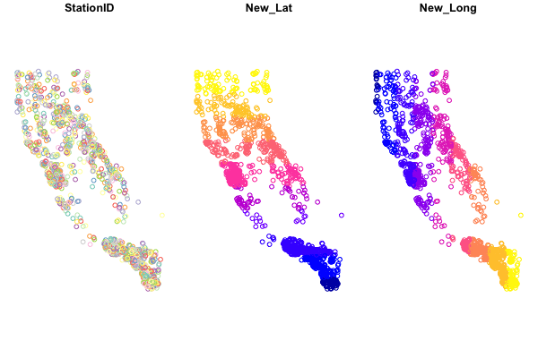

```{r setup, include=FALSE, purl=FALSE, message=FALSE}

knitr::opts_chunk$set(echo = TRUE)
library(knitr)
library(icon)
library(here)

```

<style>
  .title{
    display: none;
  }
</style>

<br>
<br>

:::obj

 **Objectives for this section:**
 
 - make a spatial {`sf`} dataframe from X and Y columns (e.g., lat & lon)
 - introduce some of the many features of {`sf`} for spatial analysis
 - read and write spatial data using {`sf`} (`.shp`, `.gpx`, `.kml`, )
 
:::

<br>

## Geospatial R: using `{sf}`

R is open source software, and more and more, it has become useful for analysis, visualization, and even writing. More recently, it has become a powerful tool for working with spatial data, making maps, etc. This is because it's free (open source), it can do nearly everything that a GUI type program can do (e.g., ArcGIS or QGIS), and you can write a script to do the same analysis many times over, saving time on repetitive tasks and making it clear how you did what you did. 

There are a variety of spatial mapping/plotting packages in R. However, the best option being used widely for vector-based spatial data in R is the [**`{sf}`**](http://r-spatial.github.io/sf/) package. **`{sf}`** is a powerful, clean, and fairly straightforward approach because it is fast and it can do most if not all of the tasks commonly done in other geospatial software programs. Even better, **`{sf}`** spatial objects are simply `data.frames` with a *sticky* geometry column, which makes it much easier to manipulate, tidy, join, and wrangle data. Basically all the geometry information gets compacted into a single column, and that column follows the data, no matter how you work with the data.

<br>


<center>

(ref:sfHorst) *Artwork by @allison_horst*

```{r sfIllustration, fig.cap='(ref:sfHorst)', echo=FALSE, out.width='90%'}

knitr::include_graphics("https://raw.githubusercontent.com/allisonhorst/stats-illustrations/master/rstats-artwork/sf.png")

```

</center>

<br>


### **Installing & Loading Spatial Packages**

The one caveat to using spatial packages in R is getting things installed and setup. Do this once, and you are good to go! But sometimes it can be a bit tricky. Ideally, we've all worked through this already, and so you have **`{sf}`** installed on your device currently. If you have already done this step, great! take a minute to look at the [**`{sf}`** webpage](http://r-spatial.github.io/sf/) and the various vignettes that are available (see [__Articles__](https://r-spatial.github.io/sf/articles/sf1.html) tab).

If you haven't installed things, make sure you grab the following packages

```{r installsf, echo=T, eval=F}

# install packages if you haven't already
#install.packages(c("sf","mapview", "tmap", "USAboundaries"))

# load packages or "libraries"
library(tidyverse) # wrangling/plotting tools
library(viridis) # nice color palette
library(sf) # "simple features" spatial package for vector based data
library(mapview) # interactive web mapping
library(tmap) # static/interactive mapping
library(USAboundaries) # data for USA boundaries

```

```{r loadLibs, echo=F, warning=FALSE}
suppressPackageStartupMessages({
  library(tidyverse); # reading/writing files
  library(viridis); # nice color palette
  library(sf); # newer "simple features" spatial package
  library(mapview); # interactive web map
  library(tmap);
  library(USAboundaries)
  }) 

```

<br>

### **Load Data**

Once we've got our libraries loaded, we need to import some data. We'll be using the data we saved [from the previous lesson](m2_2_joins.html). We'll use the `data/csci_sites_match.rda` file, which since we are following the [data management/organization tips](02_project_management.html), we are in an RStudio Project, and we have a `data` folder with our data file inside! 

```{r load, echo=T, eval=T}

# Notice the relative path
load(file = "data/csci_sites_match.rda")

```
<br>

### **Inspect the Data**

If we look at a summary of the latitude and longitude, what do we notice? 

```{r summLats}

summary(csci_sites_match)

```

<br>

:::challenge

**Challenge 1**

For X/Y data (latitude, longitude, UTM Northing or Easting, etc), why might it be important to inspect these data before plotting?

:::


<details>
  <summary class="challenge-ans-title">**Click for Answers!**</summary>
  <div class="challenge-ans-body">
  
For data from the North American continent, and especially when using lat/long coordinates, keep an eye on **longitude**. It typically should be `negative`. A common snafu that can occur is a few values (or all) from the longitude column may remain positive, which means the data typically plots somewhere in the Indian Ocean. Make sure all your longitudes are negative (if in the US and using lat/longs). A similar issue that can arise may be a data entry error, where a UTM value is missing a digit, or a switch in digits occurs (i.e., 38.7 vs. 37.8). All more reason to check the range of your spatial data and make sure it makes sense!

Here's one way to fix or make sure you have all negative longitude (again, assuming we are working with data from N. America, and it's **WGS84** datum).

```{r Fixlatlong, echo=T, eval=F}

csci_sites_match$lon <- abs(csci_sites_match$lon) * -1 # make all values negative

range(csci_sites_match$lon)

```


  </div>
</details>

<br>

## Making Data Spatial (Adding the `geometry` column)

Once we have vetted our data, let's make it *spatial* and create a few quick test plots. To make an **`{sf}`** object, we are creating a `geometry` column. This contains all the geospatial information we need, and it lives within the dataframe. Perhaps most importantly is that its "sticky", meaning whatever we do to our data (tidy, filter, mutate etc) the associated `geometry` column will stick with the data. What's awesome is this column can contain anything from information for a point to a line to a complex polygon. All in one column. *To make this, we need to know two important pieces...*

 - Which columns contain the geospatial coordinates in (either name or column number)?
 - What [projection](http://spatialreference.org/ref/epsg/) or [EPSG (CRS, SRID, etc)](http://epsg.io/) is the data in/or that we want to use?

<br>

### **Datums, Projections, & CRS?**

One of the trickier things to figure out when working with spatial data is how it should be oriented or "projected" onto the earth's surface. Different parts of the world work in different Coordinate Reference Systems, or CRS. A really nice example of how this all works can be found via the [Data Carpentry Geospatial Lesson](https://datacarpentry.org/organization-geospatial/03-crs/). Here's the oversimplified way to think about it in relation to fruit!

Imagine an orange (or any ellipsoid fruit:  `r icon::fa("lemon", color="gold1")`). The &nbsp;`r icon::fa("globe-americas", color="steelblue")`&nbsp;isn't a perfect sphere! This is the **datum**, the underlying shape we use to represent our geographic space. Now, if we wanted to place a point on our fruit-shaped Earth, we could drape a piece of fabric over the ellipsoid shape and use it to draw our points or lines on. However, the fabric (or **projection**) isn't quite big enough to cover the whole globe, so near the edges things get messy, and you need to stretch things a bit to make it work. At the center of the fabric there's very little stretching and this is where things are most accurate. When working with spatial data, we typically want to find a **datum** and a **projection** (if applicable) that will give the least amount of stretching for the location/region we're working in. There are generally two kinds of CRS: *geographic*, and *projected*. 

 - **Geographic Coordinate Systems** use Latitude and Longitude and a **datum** to identify where the center of the fabric will be placed on our orange-shaped Earth.
 
 - **Projected Coordinate Systems** essentially convert the 3-dimensional orange into a 2-dimensional grid with X and Y points (Easting and Northing). Now we are taking just the orange peel of our globe, and trying to flatten it out. Projected Coordinate Systems are much more specific to a given region of the world because they must distort things to make the conversion work. 

There are CRS codes that we can use to represent all these things, and {`sf`} makes this easy to integrate into our data.

A few common CRS Projections used in California for state/federal work:

 - **Projected**: [NAD83 California Albers: EPSG 3310](http://epsg.io/3310)
 - **Projected**: [NAD83 California Teal Albers: SR-ORG:10](http://spatialreference.org/ref/sr-org/10/)
 - **Geographic**: [WGS84 Lat Lon: EPSG 4326](http://epsg.io/4326)

<br>

<details><summary class="extra-practice-title"><b>Extra Info!</b></summary>
  <div class="extra-practice-body">
  This is a complicated subject and don't expect to learn it all at once. For more details, we definitely recommend reading through Robin Lovelace's Geocomputation in R book, especially the sections on CRS and Reprojecting your data.

  - [Section 2.4 on Coordinate Reference Systems (CRS)](https://geocompr.robinlovelace.net/spatial-class.html#crs-intro)
  - [Section 6.1 on Reprojecting Data](https://geocompr.robinlovelace.net/reproj-geo-data.html)
  </div>
</details>
<br>

<br>

### **Making a `{sf}` dataframe**

To make a dataframe with X and Y coordinates into an **`{sf}`** dataframe (so it's spatial and we can do all kinds of cool spatial/mapping operations), we can use the `st_as_sf()` function. We will also add a CRS projection so the data will show up in the right part of the world.

```{r makespatial, eval=TRUE, echo=TRUE}

# make data sf object: 
df_sf <- st_as_sf(csci_sites_match,
                  coords = c("lon", "lat"), # note we put lon (or X) first!
                  #coords = c(10, 9), # can use numbers here too
                  remove = F, # don't remove these lat/lon cols from the dataframe
                  crs = 4326) # add projection (this is WGS84)

```

<br>

### **Transform to different projection?**

Now that our data is in this format, it's pretty easy to transform/convert to another spatial projection. Here we can check our current CRS, then switch the projection over to something different.

```{r transformSF, eval=T, echo=T}

# check CRS first:
st_crs(df_sf)

# change CRS using st_transform
df_sf_albers <- st_transform(df_sf, crs=3310)

# check that it changed
st_crs(df_sf_albers)

```

<br>

:::challenge

**Challenge 2**

How do we know data is in a **Geographic** or **Projected** Coordinate System? Where can we see this information using the `st_crs()` function?

:::

<br>

<details>
  <summary class="challenge-ans-title">**Click for Answers!**</summary>
  <div class="challenge-ans-body">
  
  When we use `st_crs()` the output has a lot of information! A couple quick things we should look at for information. The 4th line down should start with either **`GEOGCRS`** or **`PROJCRS`**. This is the place we want to look to figure out if we are using a *Geographic* or *Projected* CRS. The information that comes after the `[`, i.e.,

  ```
  ## PROJCRS["NAD83 / California Albers"]
  ```
 tells us the CRS name...sometimes these are descriptive, sometimes not. 
 
 The one other important bit to be aware of is what units the CRS is in...look for something that says `LENGTHUNIT` (there may be multiple spots, but we want the line after `ELLIPSOID`), and see what it says. For example, for the EPSG:3310, our unit of measure is `LENGTHUNIT["metre",1]`, which is meters. Useful to know when doing geospatial operations on your data!
 
 </div>
</details>

<br>

## Importing Spatial Data with `{sf}`

The great thing about `sf` is that it generally makes reading (and writing!) spatial data pretty easy. Let's import a few more pieces of data in different formats, just to practice getting other data into R. Note, if you want to know more about how these data were created, check out the `r icon::fa("rocket", color="maroon")` [lesson](m3_1_usaboundaries.html).

### **Read in a Shapefile** 

First let's read in a shapefile. This is one of the more common geospatial datatypes. Note, there are two functions to read in data with `sf`, `st_read`, and `read_sf`. See the differences below. Here we'll read in a shapefile with a few west coast states we can work with.

```{r getStates, echo=T, eval=T}

states <- st_read("data/states_boundaries.shp",
        stringsAsFactors = FALSE, 
        as_tibble = TRUE)

# note, read_sf is the same as above, but it is "quiet" 
# so it doesn't print out the details, and uses the other arguments above as defaults
# read_sf("data/states_boundaries.shp)

```

Take a look at the data, notice all the attributes (columns), and a single `geometry` column where the spatial data lives.
<br>

### **Read in a `geojson`**

We'll follow the same process as above, but this time for California counties, and a `geojson` file.

```{r getCntys, echo=T, eval=T}

counties <- st_read("data/ca_counties_boundaries.geojson",
        stringsAsFactors = FALSE, 
        as_tibble = TRUE)

# check the CRS
st_crs(counties)

```

Success! Onward...
<br>


## Plotting `{sf}` Data

Now we have some different data layers, and we can make a few quick plots to see how our data looks. There are a few options that we'll cover, including using `ggplot`, but let's look at the simplest option first. We can use the base `plot` function, but there are a few things to be aware of! 

<br>

### **Plotting with `plot`**

If we try to view our `{sf}` dataframe in a plot by running: 

`plot(df_sf)`
 
 We see something like this:
 
 

Base-plotting functions work with **`{sf}`**, but `plot(your_sf_object)` will default to plotting a facet or map for **every column** of data in your dataframe. Avoid that by specifying `st_coordinates()` or `$geometry` to ensure only the spatial data gets plotted.

<br>

```{r singleSF1, echo=TRUE}

# single layer
plot(df_sf$geometry)
# same as plot(st_coordinates(df_sf))

# add some flair
plot(df_sf$geometry, col = "orange")

```

<br>

:::challenge

 **Challenge 3**
 
 - **How can we find out how to change the shape of the points using the `plot` function?**
 
:::

<br>

<details>
  <summary class="challenge-ans-title">**Click for Answers!**</summary>
  <div class="challenge-ans-body">

**Ultimately we can make our plots as fancy as we want. But to figure the above question out, I'd recommend these options:**

 - Google: *"[R] how to change shape of points using plot"*
 - Use built-in R help: `?plot` or `?points`
 - Which may help you find **`pch`**...try `?pch` and scroll to the bottom.
 </div>
</details>

<br>

### **Fancying up your (`base`)Plot**

Let's add a few additional features to our map, using the baseplotting `plot()` function, and adding an `ifelse` statement to plot different colors for CSCI scores above or below 0.75. If you haven't used an `ifelse` statement before, it works as follows: `ifelse(` *`if something is true`*, *`do something`*, ELSE IF NOT TRUE: *`do something else`*`)`.

```{r singleSF2, eval=T, echo=T}

# this is better
plot(df_sf$geometry, 
     pch=16, 
     # purple dots are CSCI > 0.75, yellow are <0.75
     col=ifelse(df_sf$CSCI>0.75, adjustcolor("purple4", alpha=0.7), "gold"), 
     cex=1.5, 
     xlab = "Longitude", ylab="Latitude")
# add a title
graphics::title("CSCI ( >0.75=purple, <0.75=yellow)")

```

Ok, so now we can make our data spatial, we can look at some preliminary plots, but what's next? 

<br><br>

## Spatial Operations

What about other spatial data or operations? The `sf` package can do nearly all the same things you can do in GIS software, like **buffer**, **crop**, **clip**, **merge**, etc. For a full list and some nice vignettes, check out the `sf` page: https://r-spatial.github.io/sf/, and click on the **Articles** tab.

There's simply too much to show and not enough time, but below are a few options including:

 - how to crop or clip one spatial dataset using another spatial dataset
 - how to create a buffer around data

<br>

### **Crop points to a Single County**

First we want to select a single county to use for our analysis. Next we want to clip our point data (CSCI) down to only points that fall inside El Dorado County. The quickest way to do this is using `st_intersection()`.

 1. `filter` our data down from the counties dataset. Find the column that contains the county names to do this.

```{r filterCnty, echo=T, eval=T}

eldor_co <- filter(counties, name=="El Dorado")
# compare rows in the counties object with the rows in the eldor_co...
```

 2. Now we can use `st_intersection` to the clip or crop our **points** layer (`df_sf`) by our **polygon** layer (`eldor_co`). Take a look at a plot to make sure it worked!

```{r stIntersection, echo=T, eval=T}

# we list the thing we want to crop first, then what we crop by second
eldor_pts <- st_intersection(df_sf, eldor_co)

```
 
 3. Make a quick plot to verify the clipped data worked. Gray points are *outside* the county line, purple points fall completely *inside* the county line.

```{r quickPlot, echo=T}


# plot
plot(eldor_co$geometry)
plot(df_sf$geometry, add=T, bg="gray", pch=21) # all the points
plot(eldor_pts$geometry, add=T, bg ="purple", pch=21) # just the points we cropped

```

### **Buffer a Polygon**

Let's add one additional tool into the mix. `st_buffer` which allows us to buffer our data. Since our data was originally *lat/lon*, the units of distance are in *degrees*, which can make it hard to translate into a precise buffer distance. However, we transformed our CSCI data into a **Projected** CRS, which uses *meters* as the unit of distance. So let's use that layer as a start, and add a 500 meter buffer around the county boundary to see if we pick up any additional CSCI points when we crop the data.

We can use the CRS from another layer to transform or "re-project" our data. Let's transform El Dorado County into the same CRS as our projected CSCI points (`df_sf_albers`).

```{r buffer, echo=T, eval=T}

# double check CRS
st_crs(df_sf_albers)

# transform the county to same CRS
eldor_co_albers <- st_transform(eldor_co, crs = st_crs(df_sf_albers))

# now buffer by 5 kilometers! (remember, units are in meters)
eldor_co_buff_5km <- st_buffer(eldor_co_albers, dist = 5000)

```

Let's plot this to see how it looks.

```{r}

plot(eldor_co_buff_5km$geometry, col="skyblue", border="steelblue")
plot(eldor_co_albers$geometry, lty=2, add=T) #original


```

 
:::challenge

 **Challenge 4**
 
 - **Crop the CSCI point data (`df_sf_albers`) by the new buffered county layer (`eldor_co_buff_5km`)** and call it `eldor_pts_5km`.
 - **How many additional CSCI points are in `eldor_pts_5km` vs. the original `eldor_pts`?**
 
:::

<br>

<details>
  <summary class="challenge-ans-title">**Click for Answers!**</summary>
  <div class="challenge-ans-body">

To do this we use the `st_intersection` function, and then inspect how many **rows** each of the point datasets contain.

```{r chalstintersect, eval=T}

eldor_pts_5km <- st_intersection(df_sf_albers, eldor_co_buff_5km)

# look at number of rows in new - old
nrow(eldor_pts_5km) - nrow(eldor_pts)

# so 8 additional CSCI stations were included in this layer.

```

 </div>
</details>

<br>

### Save and Export

We've only skimmed the surface, but let's save these pieces and move to the next lesson on making some nice maps!


```{r}

save(df_sf_albers, df_sf, eldor_co, eldor_co_albers, eldor_co_buff_5km, eldor_pts_5km, eldor_pts, file = "data/m2_3_out_eldorado_sf.rda")

```


<br>


Great work! Let's [move to the next lesson](m2_4_mapping_w_sf.html).