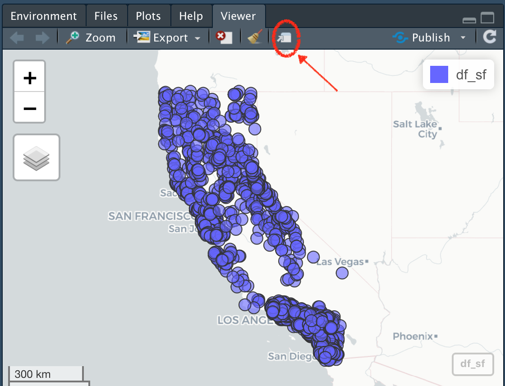

```{r setup, include=FALSE, purl=FALSE, message=FALSE}

knitr::opts_chunk$set(echo = FALSE)
knitr::opts_chunk$set(cache = FALSE)
library(knitr)
library(icon)
suppressPackageStartupMessages(library(dplyr))

```

<style>
  .title{
    display: none;
  }
</style>

<br>
<br>

:::obj

 **Objectives for this section:**
 
 - Make dynamic interactive webmaps
 - Read in several spatial layers (`.shp`, `sf`)
 - Make a map with `ggplot` and `geom_sf`
 
:::

<br>

## Mapping In R

### **Load packages**

First let's load the packages we'll be using.

```{r installsf, echo=T, eval=F}

# load packages or "libraries"
library(tidyverse) # wrangling/plotting tools
library(sf) # newer "simple features" spatial package
library(mapview) # interactive web mapping
library(tmap) # static mapping

```

```{r loadLibs, echo=F, warning=FALSE}
suppressPackageStartupMessages({
  library(tidyverse); # reading/writing files
  library(sf); # newer "simple features" spatial package
  library(mapview); # interactive web map
  library(tmap);
  }) 

```

<br>

### **Load Data**

First we need to import some data. We'll be using the data we saved [from the sf lesson](m2_3_using_sf.html). Since we are following the [data management/organization tips](02_project_management.html), we are in an RStudio Project, and we have a `data` folder with our data file inside! 

```{r load, echo=T, eval=T}

# This is points and El Dorado County Data
load("data/m2_3_out_eldorado_sf.rda")

# this is state boundaries
states <- st_read("data/states_boundaries.shp",
        stringsAsFactors = FALSE, 
        as_tibble = TRUE)

# filter to just CA
CA <- filter(states, name=="California")

```

So we have most of our pieces from the previous lesson, including the CSCI point data, the El Dorado county line and buffer, and the points that only fell inside either the buffer or the county.

<br>

## Plotting with Interactive Maps: `{mapview}`

One of the easiest and coolest packages you'll find for interactive mapping is the **`{mapview}`** package. As long as data are in an `sf` format, you can quickly make an interactive map with your data. First let's make sure we have an `sf` class of data.

```{r sfClass, echo=T, eval=T}

# check data is in sf format?
class(df_sf)

```

Next we can use the simple `mapview()` function to see a default interactive webmap! 

```{r mapview, echo=T, eval=F}

# make a map with mapview
mapview::mapview(df_sf, layer="CSCI Sites")

```

```{r tmapHidden2, echo=F, eval=T, message=FALSE, warning=FALSE}

# having to do this behind the scenes because of a weird rendering issue that's not resolved
library(tmap)
tmap_mode(mode = "view")

tmap::tm_shape(df_sf, name = "CSCI Sites") +
  tm_dots(col="slateblue", border.col="black", alpha=0.9, title = "CSCI Sites", legend.show = T, shape = 21)

```


<br>

Pretty cool! Note, we can open this in our default web browser by clicking on the little box and arrow to expand and view.

```{r expand, echo=F, eval=T, out.width='80%'}



```

<br>

### **Customizing `{mapview}`**

There are lots of customization options within `{mapview}`, I recommend checking the [mapview page](https://r-spatial.github.io/mapview/) to find out more. Here are a few handy tips to change the color, the size, and layer name.

```{r mapviewCustom, eval=F, echo=T}

mapview(df_sf, 
        col.regions="salmon", 
        cex=3, 
        layer.name="CSCI Sites")

```

```{r tmapHidden3, echo=F, eval=T,message=FALSE, warning=FALSE}

# having to do this behind the scenes because of a weird rendering issue that's not resolved
tmap_mode(mode = "view")

tmap::tm_shape(df_sf, name = "CSCI Sites") +
  tm_dots(col="salmon",size = 0.3, border.col="black", alpha=0.8, title = "CSCI Sites", legend.show = T, shape = 21)

```


<br>

### **Export and Save Mapview**

There a few options to do this. The best option currently is to click on the export button and save as a webpage.

```{r saveButton, eval=T, echo=F, out.width='80%'}

knitr::include_graphics("images/mapview_save_out.png")

```

<br>
 
## Plotting with `{ggplot}`

Alternatively, we can use `ggplot2` instead. This is where `sf` objects are really nice. They fit well within the ggplot framework because they are simply dataframes with a `geometry` list-column at the end. You can plot the X/Y data as part of a `geom_point` layer, or you can use the `geom_sf` function.

### **CSCI Sites in California with `geom_sf`** 

Let's make a map of all the CSCI stations in California. Let's also add a scale bar and north arrow with the handy [`ggspatial`](https://paleolimbot.github.io/ggspatial/) package

```{r GGsf, eval=T, echo=T, message=FALSE, warning=FALSE}

library(ggspatial)

nicemap<-
  ggplot() + # set up the framework
  
  # use GEOM_SF
  geom_sf(data = CA, color="gray", lwd=2) + # add the state outline using geom_sf
  
  # use GEOM_POINT: note, we could use geom_sf instead here too!
  geom_point(data=df_sf, aes(x=lon, y=lat), fill="orange", pch=21, alpha=0.7, size=2)+
  
  # scale bar & north arrow
  ggspatial::annotation_north_arrow(location="tr") +
  ggspatial::annotation_scale() +
  # formatting
  labs(x="Longitude (WGS84)", y="Latitude", title="Map of CSCI Sites") + 
  theme_bw() # change this to sans if it doesn't plot

nicemap

# To save plot
# ggsave(filename = "figures/site_map_ggplot.png", width = 8, height = 6, units = "in", dpi = 300)
```


### **Interactive Map!**

Finally, let's make a dynamic map that shows the CSCI scores!

```{r mapviewCSCI, echo=T, eval=F}
mapview(eldor_pts, zcol="CSCI", layer="CSCI")

# add another layer by linking with "+"
mapview(eldor_co, layer="El Dorado County") +
  mapview(eldor_pts, zcol="CSCI", layer="CSCI")

```

```{r tmapHidden, echo=F, eval=T, message=FALSE, warning=FALSE}

# having to do this behind the scenes because of a weird rendering issue that's not resolved (https://github.com/r-spatial/mapview/issues/312)
# (https://github.com/r-spatial/mapview/issues/330)

#tmaptools::palette_explorer()

library(tmap)
tmap_mode(mode = "view")

tm_shape(eldor_co, name="El Dorado County") +
  tm_polygons(alpha=0.2, lwd=2, col = "slateblue") +
  tm_shape(eldor_pts, name = "CSCI Sites") +
  tm_symbols(col="CSCI", palette = "viridis", border.col="black", 
          alpha=0.9, size=3, shape = 21)
    

```


### **Static Map**

 > **Challenge**: Can you make the same map as below using ggplot? Hint, `viridis` may be useful here...

```{r staticCSCI, eval=T, echo=FALSE}

ggplot() +
  geom_sf(data=eldor_co, col="gray", alpha=0.4, lwd=2) +
  geom_sf(data=eldor_pts_5km, pch=21, size=1.5, fill="gray70", alpha=0.4) +
  geom_sf(data=eldor_pts, aes(fill=CSCI), pch=21, size=5) +
  scale_fill_viridis_c("CSCI") + 
  theme_bw()

```


## Interested in Learning More?

There are loads of resources...but a geospatial workshop you may want to check out is run by the Carpentries. Lessons/material are freely available here: 

 - https://datacarpentry.org/geospatial-workshop/